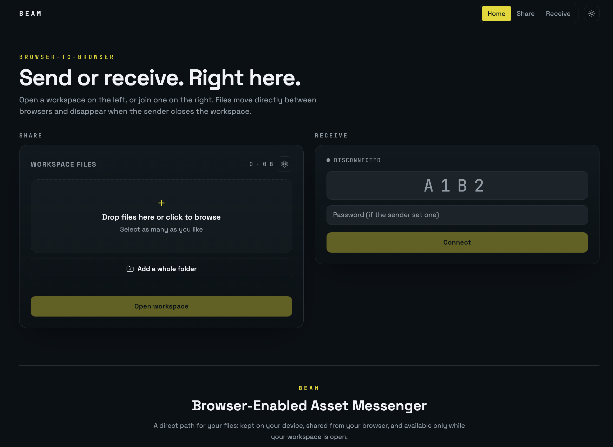
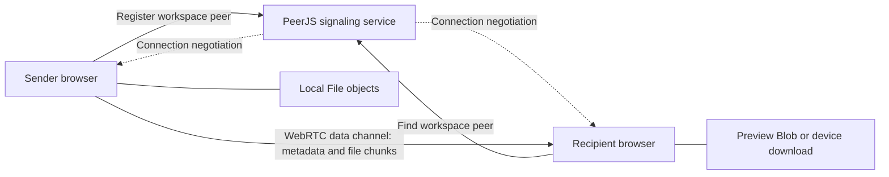
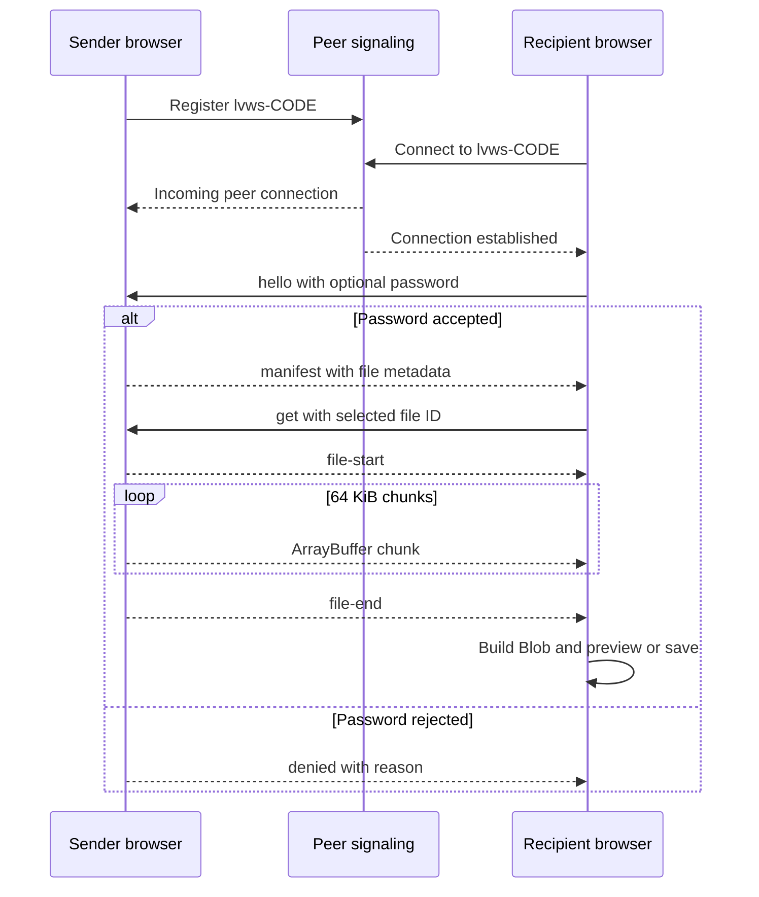
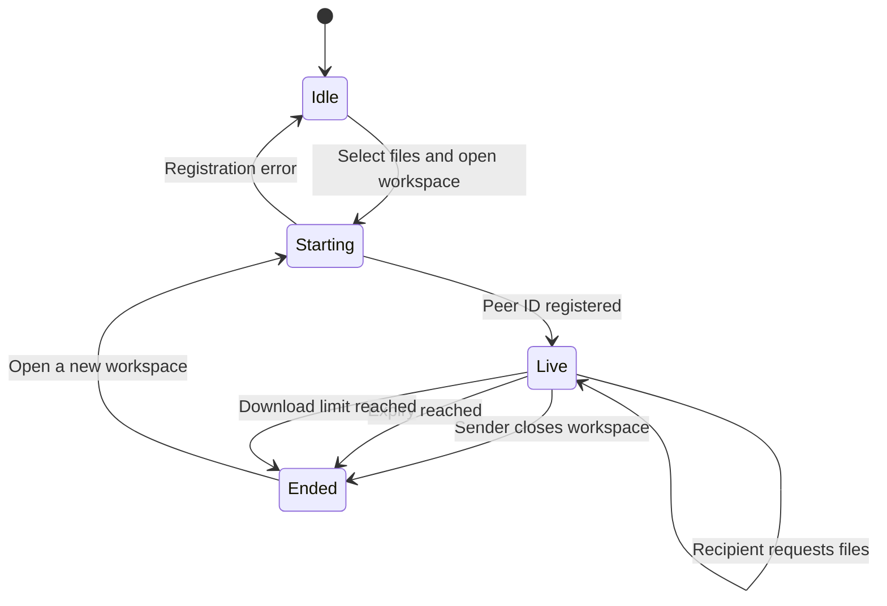

# BEAM

**Browser-Enabled Asset Messenger** is an ephemeral, browser-to-browser file sharing application. A sender selects one or more local files, opens a temporary workspace, and shares a four-character ID or QR link. Recipients use that workspace ID to request files directly from the sender's open browser.



BEAM does not upload file contents to an application database or object store. The selected `File` objects remain in the sender's browser and are transmitted only when a connected recipient requests them.

## Features

- Share and receive from the same homepage, with focused `/share` and `/receive` pages also available.
- Select multiple files by browsing or drag-and-drop.
- Add more files or folders at any point, including while the workspace is live and a transfer is in progress.
- Four-character workspace IDs using unambiguous uppercase letters and digits.
- QR links that open the receive page and populate the workspace ID automatically; the address bar follows whichever code is joined.
- Optional workspace password.
- Configurable expiry: 5 minutes, 15 minutes, 1 hour, 8 hours, or no expiry.
- Configurable download limit counted per recipient or per transfer.
- Pause and resume individual transfers from either side, with additional requests queued in order.
- Automatic reconnect and retry when the peer connection drops, plus a per-file Retry button.
- Session activity feed on both sides covering adds, discoveries, pauses, resumes, downloads, removals, and failures.
- Live connection state, connected-recipient count, progress, transfer speed, and estimated time remaining.
- In-browser previews for common image, video, audio, PDF, and text files.
- Light and dark themes, persisted in the browser.
- Clear per-file errors for unavailable workspaces, incorrect passwords, disconnections, and interrupted transfers.

## Privacy model

BEAM is designed around local custody:

1. Selecting a file gives the page a browser `File` reference; it does not upload the file.
2. The sender opens a PeerJS peer identified by the workspace ID.
3. A public PeerJS signaling service helps the browsers discover each other and negotiate a WebRTC connection.
4. File bytes travel over the resulting peer data connection in 64 KiB chunks.
5. The recipient assembles those chunks into a browser `Blob` for preview or download.
6. Closing the sender's page destroys the peer and makes the workspace unavailable.

The signaling service is external infrastructure, but it coordinates the connection rather than acting as file storage. WebRTC normally uses encrypted transport. Depending on network conditions, WebRTC may require a relay; deployment-specific PeerJS/ICE configuration determines that behavior.

### Important limitations

- The sender's page, device, and network connection must remain active throughout discovery and transfer.
- Workspace state and selected files are not restored after a refresh or browser close.
- A four-character ID is convenient, not a high-entropy secret. Use a password for sensitive workspaces and share credentials separately.
- Password checking occurs in the sender's live browser; passwords are not persisted.
- Streaming a very large download straight to disk relies on the File System Access API; browsers without it fall back to assembling the file in memory.
- Resuming an interrupted transfer works while the recipient's page stays open; a refresh discards partial data and restarts the file.
- The safety phrase confirms you are talking to the expected peer, but WebRTC media encryption is the only transport protection — there is no additional application-layer encryption.

### Implemented safeguards

- **Download limits** can count unique recipients (each person once) or individual file transfers, selectable in workspace settings and enforced per peer.
- **Large files** above 32 MB stream directly to a location the recipient chooses, so they never have to fit in browser memory.
- **Recipient approval** is exposed as a setting; pending guests wait while the sender approves or declines them in the Connected list.
- **Integrity verification** uses a streaming SHA-256 computed on both sides; a mismatch fails the transfer instead of saving a corrupt file.
- **Resumable transfers** continue from the last received byte after a dropped connection.
- **Directory sharing** is supported through the folder picker, preserving each file's relative path.
- **Identity verification** derives a three-word safety phrase from an ECDH key exchange that both sides can compare.

### Live workspace behaviour

- **Add files at any time.** The sender can add files or folders while the workspace is live and while a transfer is running, using the drop zone or the **Add files** button in the file-list header. Every change rebroadcasts the manifest to each authorized peer, with one delayed retry for a connection that is momentarily not open. Removing a file rebroadcasts too.
- **New-file discovery.** Files that appear after the recipient connected are marked `new` in the recipient's list and recorded in its activity feed.
- **Pause and resume.** Either side can pause a running transfer; the sender halts the chunk loop and the recipient resumes from the byte it already holds. Additional requests queue and start when the current file finishes.
- **Automatic retry.** If the peer connection drops mid-transfer, the recipient reconnects on its own — up to three attempts with increasing delay — then re-requests the interrupted file (resuming from its partial data) along with anything that was queued behind it.
- **Manual retry.** A failed file shows a **Retry** (or **Resume**) button. It continues over a live link, or reconnects first and then continues.
- **Activity feed.** Both sides keep a timestamped session feed. The sender logs files added and removed, guests joining and leaving, approvals, wrong passwords, requests, resumes, pauses, completed sends, limit blocks, and failures. The recipient logs connecting and reconnecting, files the sender adds or removes, requests, pauses, resumes, completed downloads, integrity failures, and each automatic retry.

## Application flow





## Technical design

### Stack

- React 19 and TypeScript
- TanStack Start and TanStack Router
- Vite
- Tailwind CSS v4 with semantic light/dark tokens
- PeerJS for peer discovery and WebRTC data connections
- `qrcode` for client-side QR generation
- Lucide React for interface icons

### Main modules

| Module | Responsibility |
| --- | --- |
| `src/components/AppShell.tsx` | Shared navigation, unified homepage, focused-page layout, and BEAM brand statement |
| `src/components/SharePanel.tsx` | Local file selection, workspace lifecycle, QR generation, settings, guests, and outgoing transfers |
| `src/components/ReceivePanel.tsx` | Workspace connection, manifest display, incoming transfer state, previews, and downloads |
| `src/components/FilePreviewModal.tsx` | Browser-native previews for supported file types |
| `src/lib/peer-share.ts` | Workspace code generation, protocol types, chunk size, and transfer formatting helpers |
| `src/lib/theme.tsx` | Theme state and browser persistence |
| `src/routes/index.tsx` | Combined Share and Receive homepage |
| `src/routes/share.tsx` | Focused sender page |
| `src/routes/receive.tsx` | Focused recipient page and QR-link code handling |

### Wire protocol

Recipient-to-sender control messages:

- `hello`: begins authorization and may include a password.
- `get`: requests a file by its generated ID.

Sender-to-recipient control messages:

- `manifest`: exposes workspace ID and file metadata after authorization.
- `denied`: reports authorization failure.
- `file-start`: declares the requested file before binary chunks.
- `file-end`: marks the end of the current file.

The protocol also defines `waiting` and `closed` messages for future lifecycle handling. Binary payloads between `file-start` and `file-end` are ordered `ArrayBuffer` chunks. The sender applies basic backpressure by waiting when the data-channel buffer exceeds eight chunks.

### Workspace lifecycle



## Local development

Requirements: a current Node.js runtime and npm or Bun.

```sh
git clone <repository-url>
cd <repository-directory>
npm install
npm run dev
```

The local site is served by Vite. Open the displayed URL in two browser windows or devices to exercise both sides of a transfer.

### Commands

| Command | Purpose |
| --- | --- |
| `npm run dev` | Start the development server |
| `npm run build` | Create a production build |
| `npm run build:dev` | Create a development-mode build |
| `npm run lint` | Run ESLint checks |
| `npm run format` | Format the project with Prettier |

## Testing a transfer

1. Open `/` or `/share` in the sender browser.
2. Add one or more files and optionally configure password, expiry, and download limit through the settings icon.
3. Select **Open workspace** and copy the ID/link or scan its QR code.
4. Open the link on another browser or enter the ID on `/` or `/receive`.
5. Supply the password if configured, connect, then preview or download a file.
6. Keep the sender page open until all transfers complete.

## Troubleshooting

- **No workspace with that code:** confirm the four characters, verify the sender page remains open, and ensure the workspace has not expired.
- **Wrong password:** reconnect using the exact password selected by the sender.
- **Connection lost:** the recipient reconnects and resumes automatically up to three times; if that fails, keep both devices online and press **Retry** on the file. A recipient page refresh discards partial data.
- **No files appear:** wait for the connection to complete and verify that the sender opened the workspace after selecting files.
- **Transfer stalls across restrictive networks:** peer connectivity depends on the available WebRTC/ICE path and signaling configuration.

## Deployment notes

Serve BEAM over HTTPS in production because browser peer connections, clipboard access, and related APIs have secure-context requirements. No application database is required for the current feature set. If self-hosting, review PeerJS signaling and ICE/TURN configuration for the network environments you need to support.
