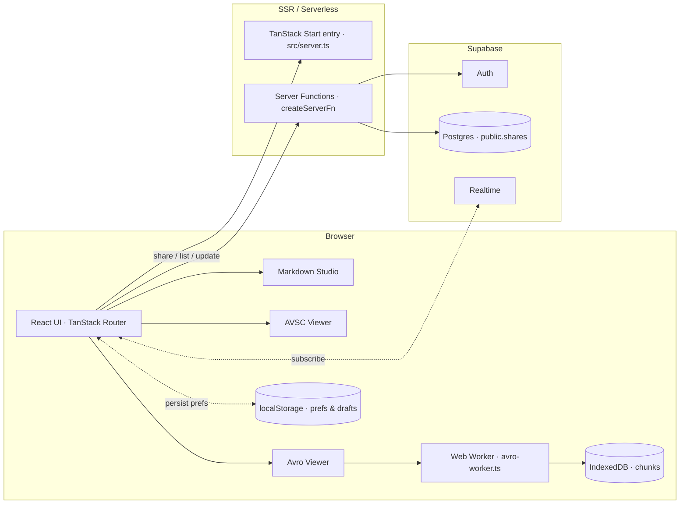
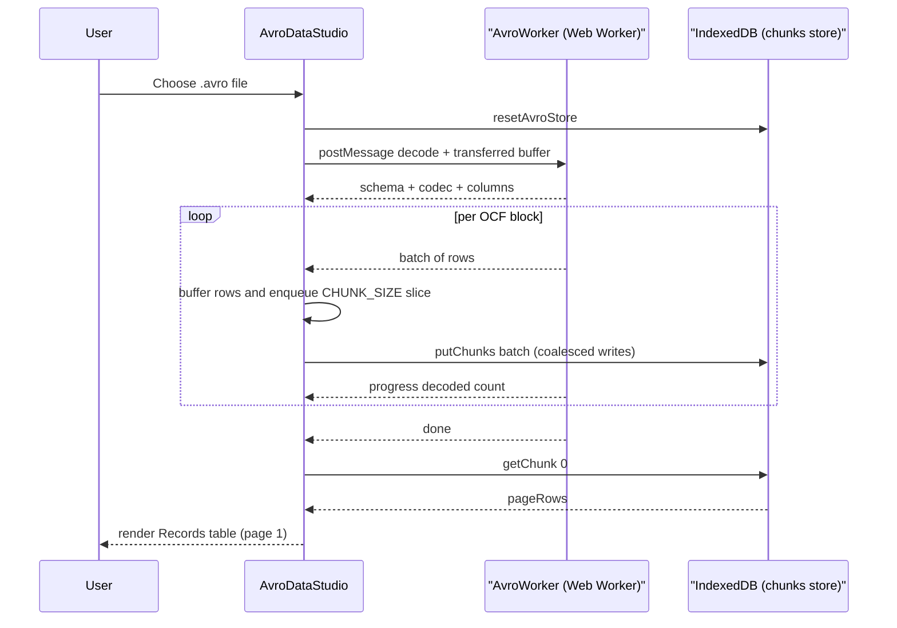

# Schema Studio - Technical Design Document

> A fast, local-first, in-browser workbench for **Markdown**, **Avro binary data (`.avro`)**, and **Avro schemas (`.avsc`)**, with optional cloud sharing for Markdown documents.

---

## Table of Contents

1. [Overview](#1-overview)
2. [Goals & Non-Goals](#2-goals--non-goals)
3. [High-Level Architecture](#3-high-level-architecture)
4. [Tech Stack](#4-tech-stack)
5. [Project Structure](#5-project-structure)
6. [Routing Model](#6-routing-model)
7. [Application Shell & UX](#7-application-shell--ux)
8. [Feature Module: Markdown Studio](#8-feature-module-markdown-studio)
9. [Feature Module: AVSC Viewer (Schema Studio)](#9-feature-module-avsc-viewer-schema-studio)
10. [Feature Module: Avro Viewer (Data Studio)](#10-feature-module-avro-viewer-data-studio)
11. [Avro Decoder Internals](#11-avro-decoder-internals)
12. [Large-Dataset Pipeline (Worker + IndexedDB)](#12-large-dataset-pipeline-worker--indexeddb)
13. [Sharing Subsystem](#13-sharing-subsystem)
14. [Authentication](#14-authentication)
15. [Persistence & Storage](#15-persistence--storage)
16. [Theming](#16-theming)
17. [Server & SSR](#17-server--ssr)
18. [Security Considerations](#18-security-considerations)
19. [Performance Characteristics](#19-performance-characteristics)
20. [Error Handling & Observability](#20-error-handling--observability)
21. [Configuration & Environment](#21-configuration--environment)
22. [Build, Dev, and Deployment](#22-build-dev-and-deployment)
23. [Database Schema (Supabase)](#23-database-schema-supabase)
24. [Extensibility Notes](#24-extensibility-notes)

---

## 1. Overview

**Schema Studio** is a single-page, SSR-capable React application that bundles three utilities into one workbench:

- **Markdown editor** with live preview, Mermaid diagrams, and export to `.md`, `.html`, or `.pdf`.
- **AVSC Viewer** for validating and pretty-printing Avro schemas.
- **Avro Viewer** for decoding Avro Object Container Files (OCF) entirely in the browser — capable of streaming 10M+ rows without freezing the UI.

The app is **local-first**: uploaded files are decoded and rendered client-side and never sent to a server. An optional **Markdown sharing** feature uses Supabase to persist shareable, password-protectable links.

---

## 2. Goals & Non-Goals

### Goals
- Zero-upload processing of Markdown, AVSC, and AVRO files.
- Handle very large Avro OCFs (10M+ rows, ~100MB+) with a responsive UI.
- Consistent workbench UX (sidebar navigation, resizable split panes, fullscreen preview).
- Optional cloud sharing for Markdown docs with password protection and view/edit access modes.
- Server-side rendering via TanStack Start deployed as a Cloudflare/Nitro worker.

### Non-Goals
- Server-side Avro processing.
- Full Avro codec coverage (only `null` and `deflate` are supported).
- Real-time collaborative editing beyond single-writer autosave with realtime refresh.
- Storing user Avro/AVSC data in the cloud.

---

## 3. High-Level Architecture



- **Client** does all Markdown rendering, Avro parsing, and PDF generation.
- **Web Worker** decodes Avro OCFs off the main thread; decoded rows are buffered into fixed-size chunks and written to **IndexedDB** for O(1) paging.
- **Server functions** (TanStack Start) run on the SSR runtime and talk to **Supabase** for share persistence.
- **Supabase Realtime** notifies open share viewers of external updates.

---

## 4. Tech Stack

| Layer | Technology |
|---|---|
| Framework | [TanStack Start](https://tanstack.com/start) (React + SSR + server fns) |
| Router | [TanStack Router](https://tanstack.com/router) (file-based routes) |
| Data | [TanStack Query](https://tanstack.com/query) |
| UI kit | shadcn/ui (Radix Primitives) + Tailwind CSS v4 + `tw-animate-css` |
| Icons | `lucide-react` |
| Markdown | `marked`, `dompurify` |
| Diagrams | `mermaid` |
| PDF | `jspdf` + `html2canvas` |
| Forms | `react-hook-form` + `zod` + `@hookform/resolvers` |
| Toasts | `sonner` |
| Auth / DB | `@supabase/supabase-js`, `@lovable.dev/cloud-auth-js` |
| Build | Vite 8, `nitro` (Cloudflare Worker target), TypeScript 5 |
| Lint / format | ESLint 9 + `typescript-eslint`, Prettier |

---

## 5. Project Structure

```
schema-studio-main/
├── src/
│   ├── router.tsx              # Router bootstrap (QueryClient injection)
│   ├── routeTree.gen.ts        # Auto-generated route tree (do not edit)
│   ├── server.ts               # Nitro/SSR entry with h3 error normalization
│   ├── start.ts                # TanStack Start bootstrap (global fn middleware)
│   ├── styles.css              # Tailwind entry
│   ├── components/
│   │   ├── app-sidebar.tsx     # Left navigation
│   │   ├── studios.tsx         # Markdown + AVSC + Avro data studios
│   │   ├── JsonTree.tsx        # Recursive JSON tree + record-array table view
│   │   ├── share-dialog.tsx    # Share creation UI
│   │   └── ui/*                # shadcn/ui primitives
│   ├── hooks/
│   │   ├── use-auth.tsx        # Supabase auth context
│   │   ├── use-mobile.tsx
│   │   └── use-theme.tsx       # light / dark / system theme
│   ├── integrations/
│   │   ├── lovable/index.ts    # OAuth (Google) via Lovable Cloud
│   │   └── supabase/
│   │       ├── client.ts             # Browser client (proxy-lazy)
│   │       ├── client.server.ts
│   │       ├── auth-middleware.ts    # `requireSupabaseAuth` server middleware
│   │       ├── auth-attacher.ts      # Client fn middleware attaching bearer
│   │       └── types.ts              # Generated DB types
│   ├── lib/
│   │   ├── avro.ts             # Pure Avro OCF decoder
│   │   ├── avro-worker.ts      # Web Worker wrapping the streaming decoder
│   │   ├── avro-store.ts       # IndexedDB chunk store (paging)
│   │   ├── share.functions.ts  # Server fns for share CRUD
│   │   ├── error-capture.ts    # SSR error capture ring
│   │   ├── error-page.ts       # Fallback SSR error HTML
│   │   ├── lovable-error-reporting.ts
│   │   └── utils.ts            # cn() etc.
│   └── routes/
│       ├── __root.tsx          # App shell (sidebar, header, footer, providers)
│       ├── index.tsx           # `/` — Utilities hub
│       ├── markdown.tsx        # `/markdown`
│       ├── avsc-viewer.tsx     # `/avsc-viewer`
│       ├── avro-viewer.tsx     # `/avro-viewer`
│       ├── auth.tsx            # `/auth`
│       ├── s.$shareId.tsx      # `/s/:shareId` — public shared markdown
│       └── _authenticated/
│           ├── route.tsx       # Layout guard (redirects to /auth)
│           └── my-shares.tsx   # `/my-shares` — manage shares
├── supabase/
│   ├── config.toml
│   └── migrations/…            # `public.shares` schema + RLS
├── package.json
├── vite.config.ts
├── tsconfig.json
├── eslint.config.js
├── components.json             # shadcn/ui config
├── bunfig.toml
└── README.md
```

---

## 6. Routing Model

Routing is **file-based**. `src/routeTree.gen.ts` is generated by the TanStack Router plugin.

| File | URL | Description |
|---|---|---|
| `routes/__root.tsx` | — | App shell (sidebar, header, footer, providers, error/404) |
| `routes/index.tsx` | `/` | Utilities hub with 3 utility cards |
| `routes/markdown.tsx` | `/markdown` | Markdown editor |
| `routes/avsc-viewer.tsx` | `/avsc-viewer` | Avro schema inspector |
| `routes/avro-viewer.tsx` | `/avro-viewer` | Avro binary data reader |
| `routes/auth.tsx` | `/auth` | Sign in / sign up (email + Google OAuth) |
| `routes/s.$shareId.tsx` | `/s/:shareId` | Public shared markdown view/edit |
| `routes/_authenticated/route.tsx` | `/_authenticated` | Guard: `beforeLoad` redirects if not signed in |
| `routes/_authenticated/my-shares.tsx` | `/my-shares` | Owner-only share management |

Each route sets its own SEO/OG `<meta>` tags via `head()`. The `/s/:shareId` route is marked `noindex`.

---

## 7. Application Shell & UX

`src/routes/__root.tsx` wraps every page in:

1. **Providers**
   - `QueryClientProvider` (React Query)
   - `ThemeProvider` (light/dark/system)
   - `AuthProvider` (Supabase session)
   - `<Toaster>` (Sonner, top-right, `richColors`)
2. **Layout**
   - `SidebarProvider` + `AppSidebar` (offcanvas collapsible)
   - Sticky header: `SidebarTrigger`, centered brand link, "Local · No upload to server" badge, upload menu (`AddFileMenu`), theme toggle
   - `<Outlet />` inside a flex column `<main>`
   - Footer strip with subtle credits

**Global upload event bus** — `AddFileMenu` in the header dispatches a `ss:trigger-upload` `CustomEvent` after routing to the matching page. The target studio subscribes via `useUploadListener(kind)` and opens its hidden `<input type="file">`.

**Pre-hydration theme script** — `__root.tsx` injects an inline `<script>` that reads `localStorage["forge-theme"]` and applies `.light`/`.dark` to `<html>` before React mounts to avoid FOUC.

**Session reset on mount** — `useAvroSessionReset` clears prior AVRO/AVSC `localStorage` keys and deletes the IndexedDB database on shell mount so datasets never leak across sessions.

---

## 8. Feature Module: Markdown Studio

Files: `src/components/studios.tsx` → `MarkdownStudio`, `src/routes/markdown.tsx`.

### Data flow
```
Textarea ──> source (usePersistedState "ss-md-source")
             │
             ▼
      marked.parse (sync)  ──> DOMPurify.sanitize  ──> html
             │
             ▼
   previewRef.innerHTML = html  ──> renderMermaidIn(container, theme)
```

### Features
- **Source ⇄ Preview** in a horizontal `ResizablePanelGroup` (default 50/50).
- **Sanitized HTML rendering** — `DOMPurify.sanitize(raw, { ADD_TAGS: ["foreignObject"] })`.
- **Mermaid diagrams** — after each render, `renderMermaidIn` scans `pre > code.language-mermaid`, calls `mermaid.render`, and swaps in the SVG. Theme (`default` / `dark`) is passed through.
- **Fullscreen preview** — a portal-like `PanelCard fullscreen` fixed to `inset-0 z-50`; only the preview stays visible.
- **File upload** — accepts `.md`, `.markdown`, `.txt`.
- **Exports**:
  - Markdown (raw source).
  - HTML (`buildPrintableDoc` wraps preview HTML in a print CSS envelope, `PRINT_CSS`).
  - PDF (render printable HTML into a hidden 820px iframe → `html2canvas` @ scale 2 → paginated `jsPDF` A4).
- **Share** — `<ShareButton>` opens the share dialog, requiring sign-in.

### Persistence keys
- `ss-md-source` — current source
- `ss-md-filename` — current filename

---

## 9. Feature Module: AVSC Viewer (Schema Studio)

Files: `src/components/studios.tsx` → `AvroSchemaStudio`, `src/routes/avsc-viewer.tsx`.

### Validation pipeline (`compileAvro`)
1. `JSON.parse(text)` → error surfaced if invalid.
2. Root must be an object.
3. `type === "record"`.
4. `name` must be a non-empty string.
5. `fields` must be an array; every field must have `name` and `type`.

Returns either:
- `{ ok: true, schema, summary, fields }` — where `summary` = `record ${namespace}.${name} · N field(s)`.
- `{ ok: false, error }`.

### Preview
- **Valid** — a `Badge`, summary line, and a fields table (`name`, `type`, `default`). Types formatted by `typeLabel()` which handles primitives, unions, `array<T>`, `map<T>`, `enum{...}`, and nested records.
- **Formatted JSON** — pretty-printed schema in a `<pre>` when parsing succeeds.
- **Invalid** — the compiler error message in destructive style.

### Exports
- Raw `.avsc` (as typed).
- Formatted `.avsc` (only offered when JSON is valid).

### Persistence keys
- `ss-avsc-source`, `ss-avsc-filename`.

---

## 10. Feature Module: Avro Viewer (Data Studio)

Files: `src/components/studios.tsx` → `AvroDataStudio`, `src/routes/avro-viewer.tsx`.

### High-level pipeline



### UI layout
1. **Stat cards** — `Records`, `Schema fields`, `Columns`, `Codec`. Records/fields/columns are recomputed by `effectiveStats`: if the file has a single wrapper record with one array-of-records field (plus scalar metadata like `totalRecordCount`), the stats reflect the *inner* dataset (fixes the common "Records: 1" wrap pattern).
2. **Schema pane** (left, 35%): raw schema JSON pretty-printed, or an upload CTA if empty.
3. **Records pane** (right, 65%): sticky-header table with:
   - `null` values italicized/muted.
   - Nested objects/arrays rendered by `<JsonTree>` (default depth 1).
   - `status`-like columns rendered as color-coded `<StatusPill>` (green/rose/amber/muted).
   - Optionally **humanized** cells for date/timestamp-looking columns.
4. **Pager** — `« First`, `‹ Prev`, `Next ›`, `Last »` with `page X / Y` and row range `rows a–b of total`.
5. **Records options menu** — toggle humanize, and export as JSON or CSV.
6. **Fullscreen** — same fixed-inset pattern as Markdown.

### Humanization (`humanizeValue`)
Applies only to non-object cells whose column name matches heuristics:
- `timestamp|_ts$|_at$|time` — numeric values are inferred as ns / µs / ms / s by magnitude and rendered as ISO strings with a `raw: … · unit` sub-label.
- `date$` — small non-negative integers are treated as days since epoch.

### Single-record view
When `meta.total === 1`, the records pane switches to `<RecordView>` — record-array fields become titled sub-tables (rendered via `<JsonTree>` with table detection), and scalar fields appear as `key: value` lines below.

### Exports
- **JSON** — streams over all IDB chunks and builds a single JSON array with human-optional cell mapping. Written via a single `Blob` and download link.
- **CSV** — header row from columns, then row batches via `forEachChunk`, using `toCsv`/`toCsvRows` for RFC-4180-ish quoting.

### Persistence keys
- `ss-avro-humanize` — humanize toggle (persists across sessions).
- No source/data persistence; the dataset lives only in IndexedDB and is reset on shell mount.

---

## 11. Avro Decoder Internals

File: `src/lib/avro.ts`.

Pure TypeScript, dependency-free. Supports Avro Object Container File (OCF) with:

- **Primitives**: `null`, `boolean`, `int`, `long`, `float`, `double`, `bytes`, `string`.
- **Complex**: `record`, `enum`, `array`, `map`, `union`, `fixed`.
- **Named type references** — tracked via `Map<string, Schema>`; both `name` and `namespace.name` are registered.
- **Codecs**: `null` and `deflate` (via `DecompressionStream("deflate-raw")` piped through a `Blob` stream).
- **Logical types**: `decimal` on `bytes`/`fixed` — decoded via `decimalFromBytes` (two's-complement big-endian → BigInt → scaled string).

### Reader
- `Reader` class holds a `Uint8Array` + `DataView` + position.
- Zig-zag varint via BigInt (`readLong`).
- 32/64-bit floats via `DataView` little-endian.

### OCF layout enforced
- Magic `0x4F 0x62 0x6A 0x01`.
- Metadata block (bytes map) — reads `avro.schema` and optional `avro.codec`.
- 16-byte sync marker; each block starts with `objectCount`, `blockSize`, `blockBytes`, and ends with a sync marker verified byte-by-byte.

### Streaming variant
`decodeAvroContainerStreaming(bytes, onSchema, onBlock)` emits the schema exactly once, then invokes `onBlock(records)` per block. Used by the Web Worker to keep memory bounded.

### Normalization helpers
- `flattenRecordsToRows` — pivots array-of-records to `{columns, rows}`.
- `deriveColumnsFromSchema` — extracts top-level record field names.
- `normalizeCell` — hex-encodes `Uint8Array`, string-ifies `bigint`, deep-normalizes nested objects/arrays.
- `toCsv` / `toCsvRows` — RFC-4180-ish quoting (`"` doubled, wrap when `,` / `"` / newline present).

---

## 12. Large-Dataset Pipeline (Worker + IndexedDB)

### Worker (`src/lib/avro-worker.ts`)

```
main → { type: "decode", buffer } (transferred ArrayBuffer)
worker → { type: "schema", schema, codec, columns }
       ↺ { type: "batch", rows, startIndex }
       ↺ { type: "progress", decoded }
worker → { type: "done", total }  |  { type: "error", message }
```

- Columns are derived from the schema up front, so the main thread can render headers before the first row arrives.
- Rows are pre-shaped in the worker via `normalizeCell` so the main thread never sees `Uint8Array` or `bigint`.

### Chunk store (`src/lib/avro-store.ts`)

- IndexedDB database `schema-studio-avro`, object store `chunks`, keyed by chunk index.
- `CHUNK_SIZE = 1000` rows per chunk.
- **Persistent connection** — a single `IDBDatabase` is kept open for the tab lifetime; measurable perf win on multi-million-row ingests (each open+close previously cost milliseconds per 1000 rows).
- **Coalesced writes** — `putChunks(entries)` writes many chunks in one `readwrite` transaction. The Studio buffers worker batches into `CHUNK_SIZE` slices, queues them, and drains them serially so writes never overlap.
- `getChunk(index)` — O(1) paging.
- `forEachChunk(cb)` — cursor iteration for exports.
- `resetAvroStore()` — closes the DB and deletes it; called on shell mount and before every new import.

### Backpressure model
The Studio's `drain()` runs at most one IDB transaction at a time; new batches queue while a drain is in flight. This keeps memory bounded even if the worker outpaces IDB throughput.

---

## 13. Sharing Subsystem

Applies only to **Markdown** documents.

### Data model — `public.shares`

| Column | Type | Notes |
|---|---|---|
| `id` | UUID PK | `gen_random_uuid()` |
| `share_id` | TEXT unique | 9-char lowercase base-32-ish (`abcdefghijkmnopqrstuvwxyz23456789`) |
| `owner_id` | UUID | FK → `auth.users(id)` |
| `title` | TEXT | default `Untitled` |
| `content` | TEXT | Markdown source |
| `permission` | TEXT | `'view' \| 'edit'` (CHECK) |
| `password_hash` | TEXT | nullable |
| `created_at`, `updated_at` | TIMESTAMPTZ | trigger auto-updates `updated_at` |

**RLS** — SELECT/INSERT/UPDATE/DELETE all gated by `auth.uid() = owner_id`. Public reads use a server-side REST call with the service/publishable key so unauthenticated visitors can read the row without RLS bypass in the client. Realtime publication includes `shares` with `REPLICA IDENTITY FULL`.

### Server functions (`src/lib/share.functions.ts`)

| Function | Method | Auth | Purpose |
|---|---|---|---|
| `createShare` | POST | ✅ | Insert new row with retry on 23505 (unique collision) |
| `listMyShares` | GET | ✅ | List all owner shares |
| `updateShareSettings` | POST | ✅ | Change `title`/`permission`/password (`null` removes, `undefined` keeps) |
| `deleteShare` | POST | ✅ | Delete by `share_id` scoped by `owner_id` |
| `getShareMeta` | GET | ❌ | Returns metadata only; no content |
| `getShareContent` | POST | ❌ | Returns content, or `password_required` / `wrong_password` / `not_found` |
| `updateSharedContent` | POST | ❌ | Public-writer path for `edit` permission; requires correct password if set |

Authenticated fns compose `requireSupabaseAuth` middleware; unauthenticated fns hit Supabase REST directly using env keys (`SUPABASE_URL` + `SUPABASE_SERVICE_ROLE_KEY` / `SUPABASE_PUBLISHABLE_KEY` / etc.).

### Password hashing
- **PBKDF2** via WebCrypto (works in Cloudflare Workerd runtime).
- Format: `pbkdf2$120000$<base64 salt>$<base64 derived>`.
- `iterations = 120_000`, `hash = SHA-256`, 32-byte derived key, 16-byte random salt.
- `verifyPassword` uses constant-time compare on base64 strings.

### Share creation UX (`ShareButton` + `ShareDialog`)
- If not signed in, redirects to `/auth?next=...`.
- Choose access (`view` / `edit`) + optional password.
- On success, presents copyable `${origin}/s/${shareId}` and points user to `/my-shares`.

### Public share page (`routes/s.$shareId.tsx`)
- Fetches with `getShareContent`; if `password_required`, shows a locked card.
- Once unlocked, renders `SharedEditor`:
  - **View-only** — preview-only card.
  - **Editable** — split editor with textarea + preview, autosave debounced 1.2s, plus a manual `Save now` button.
  - **Realtime** — subscribes to `postgres_changes` on the row via `supabase.channel(share:${id})`. Remote updates refresh local state only when `!dirty`.
  - **Exports** — MD / HTML / PDF using a separate `SHARE_PRINT_CSS` envelope.
  - **Robots** — `<meta name="robots" content="noindex">`.

### Owner management (`routes/_authenticated/my-shares.tsx`)
- Lists shares in a card grid (title, badges for `Editable` / `Password`, updated timestamp, URL).
- Actions: Copy URL, Open in new tab, Edit (title/permission/password), Delete (with `confirm`).
- Password mode radio group: **Keep current**, **Set new**, **Remove** (only shown when a password exists).

---

## 14. Authentication

`src/routes/auth.tsx` — a single card with:
- **Google OAuth** via `lovable.auth.signInWithOAuth("google", { redirect_uri: origin + "/auth" })`.
- **Email/password** via `supabase.auth.signInWithPassword` / `signUp`. Sign-up uses `emailRedirectTo: origin + "/auth"` and a minimum 6-character password.
- After sign-in, the effect redirects to `next` (if it starts with `/`) or `/`.

`src/hooks/use-auth.tsx` — `AuthProvider` subscribes to `supabase.auth.onAuthStateChange` and hydrates via `getSession()`.

### Auth attachment for server fns
- `src/integrations/supabase/auth-attacher.ts` — a client-side `functionMiddleware` that grabs the current access token from `supabase.auth.getSession()` and attaches it as `Authorization: Bearer <jwt>`. Registered globally in `src/start.ts` (see `AGENTS.md` note).
- `src/integrations/supabase/auth-middleware.ts` — server-side `requireSupabaseAuth`. Validates the bearer token with `supabase.auth.getClaims(token)`, requires `data.claims.sub`, and injects `{ supabase, userId, claims }` into the server-fn context. It also normalizes the "new Supabase API keys" case (`sb_publishable_` / `sb_secret_`) which are opaque, not JWTs.

---

## 15. Persistence & Storage

| Layer | Purpose | Scope |
|---|---|---|
| `localStorage` (`usePersistedState`) | Markdown source & filename, AVSC source & filename, `humanize` toggle, `forge-theme` | Persists across sessions |
| `localStorage` reset on mount | Clears `ss-avsc-*`, `ss-avro-mode`, `ss-avro-humanize`, `ss-section` | Per shell mount |
| `IndexedDB` (`schema-studio-avro`) | Avro row chunks (paging) | Reset on shell mount and per import |
| Supabase Postgres | Shared markdown documents | Owner-only, with public read via server fn |

---

## 16. Theming

- **`ThemeProvider`** (`src/hooks/use-theme.tsx`) stores `light | dark | system` in `localStorage.forge-theme`.
- Applies `.light` / `.dark` to `<html>`; subscribes to the `(prefers-color-scheme: dark)` media query when in `system` mode.
- **Header toggle** (`ThemeToggle`) flips between light and dark by resolving the current effective theme first.
- Mermaid is re-initialized per render with the current theme so diagrams match app color scheme.

Tailwind v4 is used via the shadcn/ui component set. Utility patterns like `bg-gradient-to-br from-primary/20 to-primary/5` drive the stat cards.

---

## 17. Server & SSR

- **Entry** — `src/server.ts` wraps `@tanstack/react-start/server-entry` with:
  - Global error capture (`consumeLastCapturedError`).
  - **h3 error normalization** — h3 swallows in-handler throws into a JSON `{"unhandled":true,"message":"HTTPError"}`. `normalizeCatastrophicSsrResponse` detects that shape on 5xx JSON responses and re-renders a friendly HTML error page (`renderErrorPage`) instead.
- **Build** — `vite.config.ts` uses `@lovable.dev/vite-tanstack-config`, which auto-registers TanStack Start, React, Tailwind v4, tsconfig-paths, and Nitro with a Cloudflare Worker target.

---

## 18. Security Considerations

- **HTML sanitization** — all Markdown-derived HTML runs through `DOMPurify` before insertion into the preview panels (with `foreignObject` allowed for Mermaid).
- **`securityLevel: "loose"`** is set on Mermaid because the diagram source is user-authored client-side; input never crosses trust boundaries.
- **Password handling** — plaintext passwords are only sent to server fns over HTTPS, hashed with PBKDF2 (120k iters, SHA-256), and never returned. `verifyPassword` uses a constant-time comparison.
- **Access model** — Supabase RLS restricts owner CRUD; the public read path uses a server fn that returns only the requested share's content (never lists rows).
- **`noindex` meta** on shared pages prevents accidental search-engine indexing.
- **CSRF/session** — server fns require a Bearer token attached client-side; no cookies used for auth.
- **Files never leave the browser** — indicated by the "Local · No upload to server" badge and the emerald pulse in the footer.

---

## 19. Performance Characteristics

- **Avro decode** runs in a Web Worker; the main thread only handles ~1 batch/frame at IDB drain cadence.
- **Column normalization** happens in the worker so `postMessage` payloads are cheap-to-clone JS values.
- **Backpressure** — buffered rows drain in serial IDB transactions; queue depth is bounded by producer/consumer rate.
- **`Array.prototype.push.apply(buffer, rows)`** avoids spreading huge arrays onto the call stack (`...rows` would overflow at ~65K args in some engines).
- **Persistent IDB connection** — `openDB` memoizes the promise; measurable win vs per-write open.
- **Pagination** — rendering is always O(`CHUNK_SIZE`) rows; the DOM never sees the full dataset.
- **PDF export** — off-screen iframe kept at `left:-99999px` so layout is real but invisible; `html2canvas` @ scale 2, then A4 pagination.

---

## 20. Error Handling & Observability

- **Root error boundary** (`__root.tsx` → `ErrorComponent`) shows a friendly "This page didn't load" page, reports via `reportLovableError`, and provides Try again / Go home.
- **404** — `NotFoundComponent` matches the same visual language.
- **Toasts** (`sonner`) for user-visible success/error paths (decode, share create/update/delete, exports).
- **Lovable error reporting** — `src/lib/lovable-error-reporting.ts` forwards runtime errors to the Lovable Cloud sink (`reportLovableError`).
- **SSR error page** — `renderErrorPage()` produces a self-contained HTML page returned when h3 returns 5xx JSON.

---

## 21. Configuration & Environment

Required environment variables:

| Variable | Purpose |
|---|---|
| `VITE_SUPABASE_URL` / `SUPABASE_URL` | Supabase project URL |
| `VITE_SUPABASE_PUBLISHABLE_KEY` / `SUPABASE_PUBLISHABLE_KEY` | Client-safe API key |
| `SUPABASE_SERVICE_ROLE_KEY` (or fallbacks) | Used by public-read server fns for share content |

`vite.config.ts` delegates env injection to `@lovable.dev/vite-tanstack-config` (auto-injects `VITE_*`).

---

## 22. Build, Dev, and Deployment

**Package scripts**:

| Script | Purpose |
|---|---|
| `npm run dev` | Vite dev server (SSR + HMR) |
| `npm run build` | Production build via Vite + Nitro |
| `npm run build:dev` | Development-mode build |
| `npm run preview` | Preview built site |
| `npm run lint` | ESLint |
| `npm run format` | Prettier |

**Target runtime** — Nitro builds a Cloudflare Worker (workerd-compatible). The share-functions module explicitly uses WebCrypto (`crypto.subtle`) so it runs unmodified on workerd.

**Lovable integration** — the repo is connected to Lovable; commits pushed to the connected branch sync back into the Lovable editor. See `AGENTS.md`.

---

## 23. Database Schema (Supabase)

File: `supabase/migrations/20260723170117_d547e1ef-bfac-4bc9-8af0-65d13ee54df5.sql`.

```sql
CREATE TABLE public.shares (
  id UUID PRIMARY KEY DEFAULT gen_random_uuid(),
  share_id TEXT UNIQUE NOT NULL,
  owner_id UUID NOT NULL REFERENCES auth.users(id) ON DELETE CASCADE,
  title TEXT NOT NULL DEFAULT 'Untitled',
  content TEXT NOT NULL DEFAULT '',
  permission TEXT NOT NULL DEFAULT 'view' CHECK (permission IN ('view','edit')),
  password_hash TEXT,
  created_at TIMESTAMPTZ NOT NULL DEFAULT now(),
  updated_at TIMESTAMPTZ NOT NULL DEFAULT now()
);
```

Highlights:
- `shares_owner_id_idx`, `shares_share_id_idx` indexes.
- RLS enabled, four policies scoped by `auth.uid() = owner_id`.
- `shares_touch_updated_at` trigger keeps `updated_at` fresh.
- Row inserted into `supabase_realtime` publication with `REPLICA IDENTITY FULL` so remote editors see full-row updates.

---

## 24. Extensibility Notes

- **Adding a codec** — extend the `codec !== "null"` branch in `decodeAvroContainer{,Streaming}` with a matching decompressor (e.g. snappy via a WASM binding).
- **Adding a new studio** — add a route file in `src/routes/`, export a component, and wire it into `AppSidebar.items` and the utility hub grid.
- **Additional export formats** — pass more `ExportAction[]` entries to `PreviewHeader`; use `askAndDownload(defaultName, mime, produce)` for consistent filename prompts.
- **New share permission levels** — add to the `permission` CHECK constraint, update `SharePatch` types, and extend the radio groups in `share-dialog.tsx` and `my-shares.tsx`.
- **File-based routing** — new files under `src/routes/` are auto-picked up by the TanStack Router plugin, which regenerates `routeTree.gen.ts`.

---

*Crafted with ♥ by Sanidhya Dash.*
