# Unveil

**Don't just send it. Unveil it.** Unveil is a personal celebration and surprise platform. People use it to build an interactive digital surprise (photos, videos, voice notes, letters, puzzles, games, countdowns and animated reveals) for someone they care about, then send it as a private link. The person receiving it doesn't need an account or an app: they open the link, tap, unwrap and play through a story made just for them.

---

## Contents

1. [Product overview](#product-overview) (non-technical): what it does, who uses it, the main journeys
2. [Architecture](#architecture): system diagram, data model, how requests are secured
3. [Setup and deployment](#setup-and-deployment): local setup, Supabase, Edge Functions, first-time checklist, scripts, troubleshooting
4. [Security model](#security-model), [Project structure](#project-structure) and [Routes](#routes)
5. **Feature reference** (technical detail per feature):
   [Authentication and profiles](#authentication-and-profiles) ·
   [People](#people) ·
   [Occasions](#occasions) ·
   [Memory Vault](#memory-vault) ·
   [Experiences (data layer)](#experiences-data-layer) ·
   [Experience Builder](#experience-builder) ·
   [Interactive blocks and recipient responses](#interactive-blocks-and-recipient-responses) ·
   [Recipient experience](#recipient-experience) ·
   [Scheduling and Surprise Drop](#scheduling-and-surprise-drop) ·
   [Collaborative contributions](#collaborative-contributions) ·
   [Group Secret](#group-secret) ·
   [Interactive scenes](#interactive-scenes) ·
   [Template library](#template-library) ·
   [Quick Create](#quick-create) ·
   [Help me write](#help-me-write) ·
   [AI editing in the builder](#ai-editing-in-the-builder) ·
   [AI infrastructure](#ai-infrastructure) ·
   [Admin console and payments](#admin-console-and-payments) ·
   [About page](#about-page) ·
   [Installable app and link previews](#installable-app-and-link-previews)
6. [Design system](#design-system), [Testing](#testing), [Adding a feature](#adding-a-feature) and [Roadmap](#roadmap)

---

## Product overview

### What Unveil is

A text message is read in a second and forgotten in a scroll. Unveil turns the same words into a small ceremony: a gift to unwrap, balloons to pop, a code to crack, photos that reveal one at a time, a letter that types itself out, and a final surprise at the end. The sender builds it in minutes from a template (or from scratch), adds their own memories, and shares a private link.

### Who uses it

| Role | Needs an account? | What they do |
| --- | :-: | --- |
| **Visitor / guest** | No | Reads the landing and About pages, and tries Quick Create at `/create` up to the preview. Signing up keeps their draft. |
| **Creator** (a signed-up user) | Yes | Keeps people, occasions and memories; builds, previews, schedules, publishes and shares experiences; sees responses; invites friends to contribute. |
| **Collaborator** (editor or viewer) | Yes | Is added to someone else's experience. Viewers can see it; editors will be able to edit it (the builder currently shows them a "coming soon" screen). |
| **Recipient** | No | Opens their personal link and plays through the surprise. Answers, hints and completion are recorded for the creator. |
| **Contributor** (a friend) | No | Opens an invite or group link and adds messages, photos, videos, memories, answers or voice notes for the creator to approve. |
| **Admin** | Yes, plus an `app_admins` row | Uses the admin console: analytics, moderation, templates, gift products, payments and coupons, the About page, AI settings and the audit log. |

### Main features at a glance

| Area | What it gives people |
| --- | --- |
| **People and occasions** | A private list of loved ones (photos, relationship, birthday, favourite things, notes) and the days worth celebrating, with yearly recurrence, a calendar and "coming up" reminders on the dashboard. |
| **Memory Vault** | A private home for photos, videos, voice notes, stories, quotes and links, with a timeline, filters, duplicate detection, and AI **memory stories** that weave chosen memories into one narrative. |
| **Quick Create** | Five guided steps: who it's for → pick an experience → personalise → preview → publish. No builder needed, and guests can try it without an account. |
| **Template library** | 31 ready-made interactive stories across birthdays, romance, anniversaries, friendship, family, graduation, thank-yous, farewells, apologies and "just because". |
| **Experience Builder** | A full visual editor: pages and interactive scenes, 15 block types, drag and drop, themes, animations, background music, stickers, autosave and validation before publishing. |
| **Interactive scenes** | Balloons, piñatas, scratch cards, combination locks, jigsaws, hidden hunts, flip cards, "Will you…?" questions where *No* runs away, sign-and-stamp promises, letters and final reveals. |
| **Sharing** | One private link per recipient, a device share sheet, live responses, and opens and completion tracked. |
| **Scheduling and Surprise Drop** | Open at a chosen time in a chosen time zone, close automatically, or release the story in up to 10 timed stages with countdowns between them. |
| **Friends and Group Secret** | Personal or group invite links for friends to contribute, owner approval, and a surprise that stays completely hidden from the recipient until the reveal. |
| **AI help (optional)** | *Help me write*, AI edits of any block, a full experience generator, quiz and puzzle generation, and memory stories. Everything also works without AI. |
| **Payments (optional)** | A price per experience with Razorpay checkout, coupons and gift products before links open. |
| **Admin console** | Analytics, users and experiences moderation, reports, templates, gift products, payments, coupons, subscriptions, the About page, AI usage, system health and a tamper-resistant audit log with an audited purge option. |
| **Look and feel** | A warm, premium design, light and dark mode, mobile-first layouts, reduced-motion support and keyboard-friendly interactions. |

### Glossary

| Term | Meaning |
| --- | --- |
| **Experience** | The surprise itself: a titled, themed set of pages. Stored as `experiences` → `experience_pages` → `experience_blocks`. |
| **Block** | One piece of content on a page: text, photo, video, audio, quote, message, question, quiz, puzzle, reveal, countdown, button, divider, memory or contributions. |
| **Scene** | A page that plays as one interactive step of a story (for example "pop the balloons"). An experience with any scenes plays as a story. |
| **Template** | A ready-made story (scenes with `{placeholders}`) that is copied into a new experience. Editing the copy never changes the template. |
| **Recipient link** | `/x/<code>` (7 letters and digits): a private, hard-to-guess link for one person. Opening it counts as their visit. |
| **Stage / Surprise Drop** | Groups of pages that unlock at later times, each with its own countdown. |
| **Group Secret** | A group surprise that the recipient can't see at all until its reveal time, while friends keep contributing. |
| **Contribution** | Something a friend sends through an invite link; it appears only after the creator approves it. |
| **Memory** | An item in the Memory Vault. Experiences reference memories by id; files are never copied. |

### How it works (creator's journey)

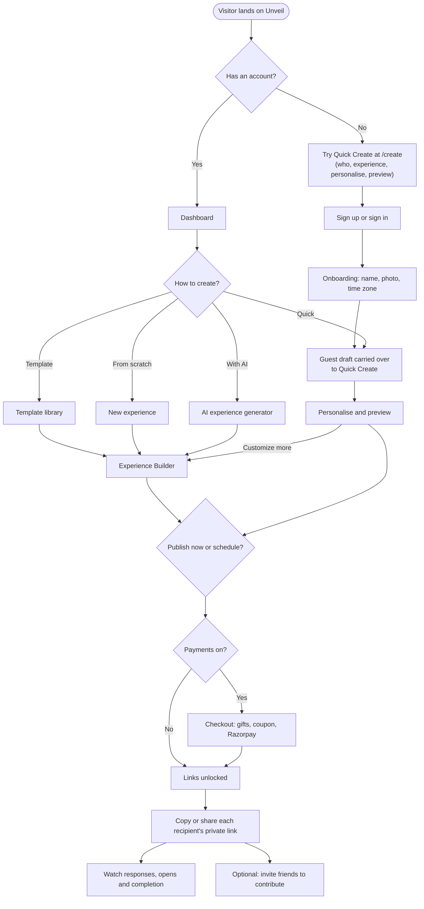

### How it works (recipient's journey)

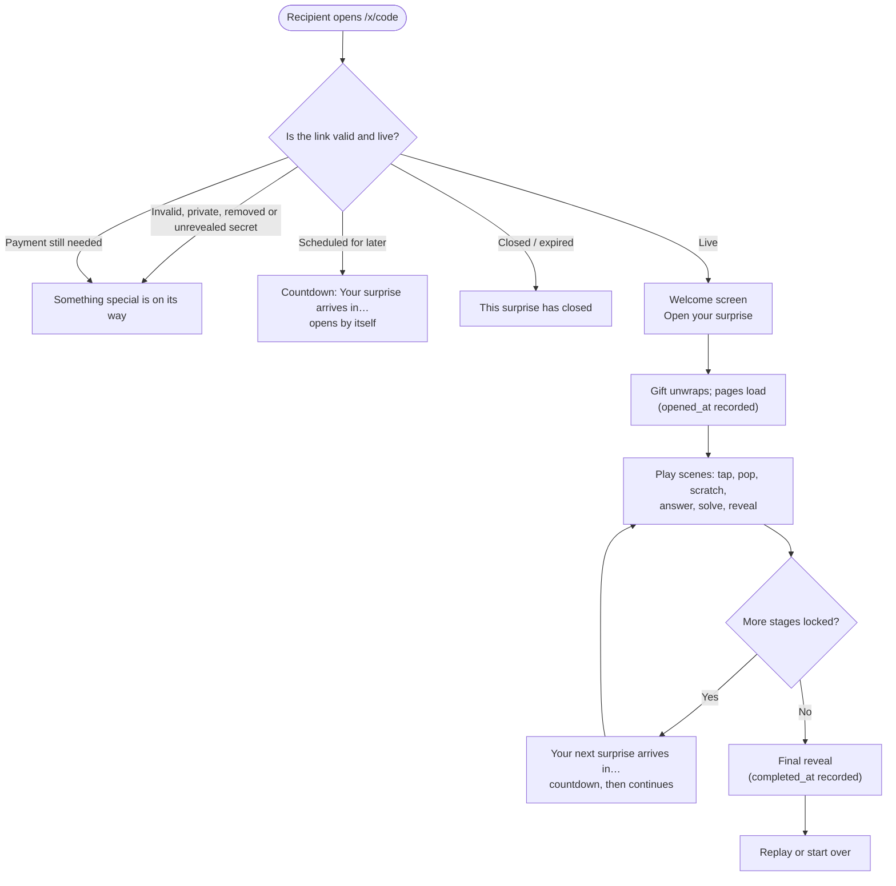

### How it works (friends contributing)

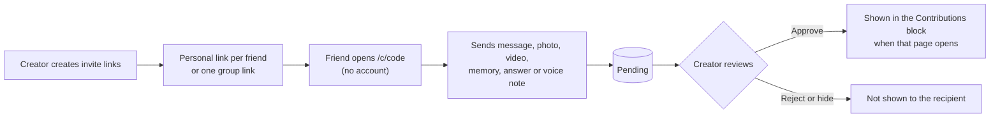

---

## Architecture

### System overview

Unveil is a single-page React app talking directly to Supabase. Row Level Security in Postgres is the authorisation layer for everything a user owns. Work that needs secrets or must not be trusted to the browser (AI, admin actions, payments, recipient and contributor links) runs in Postgres security-definer functions or Supabase Edge Functions.

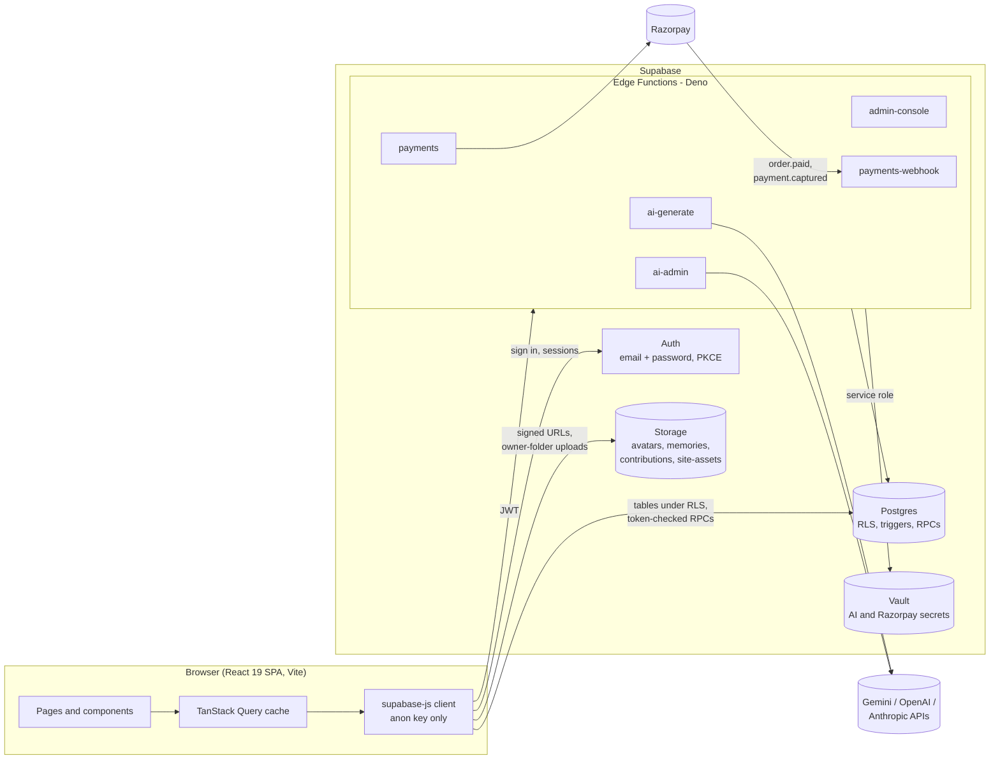

### Which layer handles what

| Kind of request | Path | Why |
| --- | --- | --- |
| A user's own data (people, occasions, memories, experiences, stories) | Browser → Postgres tables | RLS policies and column grants allow only the owner (and collaborators where designed). |
| Recipient links and contributor links (no account) | Browser (anon) → security-definer RPCs | The RPC checks the token, the schedule, moderation and payment status, and strips hidden answers before returning anything. |
| Private files | Browser → Storage with short-lived signed URLs | Buckets are private and policies check the owner folder or the token-issued upload ticket. |
| AI | Browser → `ai-generate` / `ai-admin` → provider | Keys stay in Vault; the server checks plan, task and usage limits and validates every reply. |
| Admin console | Browser → `admin-console` | Every call re-checks `app_admins`; admin tables have no browser policies; every change is audited. |
| Payments | Browser → `payments` → Razorpay; Razorpay → `payments-webhook` | Amounts are computed on the server; payment signatures are verified before an experience is unlocked. |

### Data model (core tables)

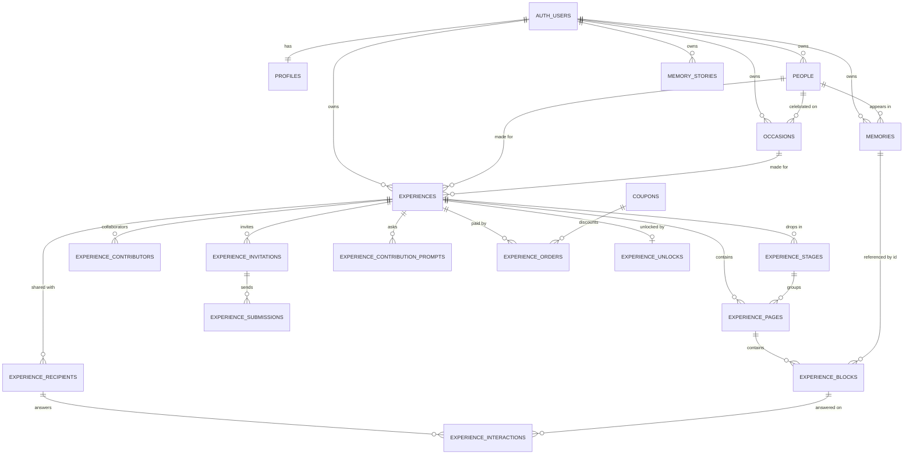

Admin, AI and site tables (`app_admins`, `admin_audit_log`, `user_moderation`, `experience_moderation`, `experience_reports`, `template_settings`, `gift_products`, `payment_settings`, `ai_*`, `site_about`) have RLS with no browser policies (except public reads where noted) and are reached through Edge Functions. Every table is described in its feature section below, and every migration is listed under [Supabase](#supabase).

### Tech stack

| Concern         | Choice                                                       |
| --------------- | ------------------------------------------------------------ |
| Build / dev     | Vite 7 (Node 20.19 or later)                                 |
| UI              | React 19 + TypeScript (strict, `noUncheckedIndexedAccess`)   |
| Routing         | React Router 7 (data router, lazily loaded pages)            |
| Styling         | Tailwind CSS 4 with design tokens in `src/styles/index.css`  |
| Server state    | TanStack Query 5                                             |
| Backend         | Supabase (Postgres, Auth, Storage, Vault, Edge Functions) with Row Level Security |
| Edge Functions  | Deno (TypeScript), bundled with esbuild for the Dashboard editor |
| AI providers    | Gemini, OpenAI, Anthropic (optional, server-side only)       |
| Payments        | Razorpay (optional)                                          |
| Icons           | lucide-react                                                 |
| Animation       | motion (`motion/react`, lazy `domAnimation`), canvas-confetti (loaded on first use); Web Audio for sound effects and music |
| Tests           | Node's built-in test runner (`node --test`) for app logic and Edge Functions; SQL verification scripts for RLS |

---

## Setup and deployment

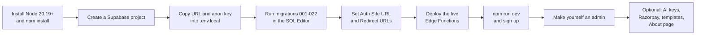

### Prerequisites

- **Node.js 20.19 or later** and npm.
- A **Supabase** project (hosted), or Docker for a local Supabase stack.
- Optional: an API key for **Gemini, OpenAI or Anthropic** (AI features), and a **Razorpay** account (payments).

### Getting started

```bash
npm install
cp .env.example .env.local     # then fill in values (PowerShell: Copy-Item .env.example .env.local)
npm run dev                    # http://localhost:5173
```

**Environment variables** (`.env.local`). Only public values belong here; everything prefixed `VITE_` is bundled into the browser.

| Variable | Where to find it |
| --- | --- |
| `VITE_SUPABASE_URL` | Supabase Dashboard → _Project Settings → API_ → Project URL (local: printed by `npx supabase start`) |
| `VITE_SUPABASE_ANON_KEY` | Same page, the **anon / publishable** key. Never the service-role or secret key: the app refuses to start with one. |
| `VITE_SITE_URL` | Optional locally, **set it in production**: the public address of the app, e.g. `https://unveil.example.com`. It makes link-preview URLs absolute ([Installable app and link previews](#installable-app-and-link-previews)). |

Server secrets (service role, AI keys, `ALLOWED_ORIGINS`) are set on the Edge Functions, not here. Razorpay keys are saved in **Admin → Payments**.

**Hosting the frontend:** `npm run build` writes a static site to `dist/`. The included `vercel.json` configures Vercel to serve `/index.html` for direct visits to client-side routes (for example, `/x/RPCdah`). Other static hosts need an equivalent SPA fallback. Set the `VITE_` variables at build time (including `VITE_SITE_URL`), serve `/sw.js` and `/index.html` with `Cache-Control: no-cache` so updates reach installed apps, add the site's origin to `ALLOWED_ORIGINS`, and add its URL to the Supabase Auth **Redirect URLs**. The site must be on HTTPS to be installable.

### Supabase

**Hosted project:** create a project at supabase.com. Copy the **Project URL** and the **anon / publishable** key from _Project Settings → API_ into `.env.local`. Then apply the migrations by running each file in `supabase/migrations` **in numeric order** (`001_…`, `002_…`, …, `023_…`) in the _SQL Editor_. Each file runs exactly once; never edit a file that has already been run. Schema changes always go in a new, higher-numbered file.

| Script | Purpose |
| ------ | ------- |
| `001_foundation_profiles.sql` | `profiles` table, RLS, `updated_at` trigger, sign-up trigger |
| `002_storage_avatars.sql` | Private `avatars` bucket and owner-folder storage policies |
| `003_profiles_onboarding.sql` | Profile fields (username, bio, timezone, onboarding) and validation |
| `004_people.sql` | `people` table, `relationship_type` enum, RLS, column grants, normalisation trigger |
| `005_occasions.sql` | `occasions` table, `occasion_type` enum, owner-checked person link, RLS, column grants, normalisation trigger |
| `006_memory_vault.sql` | `memories` table, `memory_type` enum, owner-checked person link, RLS, column grants, private `memories` bucket and storage policies (needs Postgres 15+) |
| `007_experiences.sql` | `experiences`, `experience_pages`, `experience_blocks`, `experience_recipients`, `experience_contributors`; four enums; `private` schema access helpers; RLS, column grants, validation/ordering triggers, reorder RPCs; cover storage policies (needs Postgres 15+) |
| `008_experience_interactions.sql` | `experience_interactions` table and enum; recipient RPCs (`open_recipient_experience`, `submit_recipient_answer`, `record_recipient_hint`, `complete_recipient_experience`) with server-side answer checks; storage policy so recipient links can load shared media |
| `009_experience_status_values.sql` | Adds `expired` and `cancelled` to `experience_status`. **Run it on its own, before 010:** Postgres can't use a new enum value in the transaction that adds it |
| `010_scheduling_and_drops.sql` | Scheduling (`expires_at`, `schedule_timezone`, status state machine in `prepare_experience`, `private.effective_status`, `release_due_experiences`); `experience_stages` table and `experience_pages.stage_id` for Surprise Drop; recipient RPCs redefined so nothing is sent or answerable before its time |
| `011_contribution_block_type.sql` | Adds `contributions` to `experience_block_type`. **Run it on its own, before 012** (same enum rule as 009) |
| `012_collaborative_contributions.sql` | `experience_invitations`, `experience_contribution_prompts`, `experience_submissions`; three enums; owner-only RLS and column grants; private `contributions` bucket with upload tickets (`private.contribution_uploads`); token-checked RPCs `open_contribution_invitation`, `begin_contribution_upload`, `submit_contribution`, `recipient_contributions` |
| `013_group_secret.sql` | `experiences.group_secret` (owner-only toggle, enforced by trigger); `private.is_unrevealed_secret`; recipient RPCs and `private.recipient_access` return nothing for an unrevealed secret; viewer collaborators can't see one until it's revealed; `open_contribution_invitation` gains group progress |
| `014_ai_infrastructure.sql` | AI infrastructure: `app_admins`, `ai_provider_configs`, `ai_task_configs`, `ai_plans`, `ai_user_plans`, `ai_model_prices`, `ai_usage_events`, `ai_usage_daily` and the `ai_usage_monthly` view. All have RLS with no browser policies. Service-role RPCs handle limits, usage and Vault-stored API keys. `is_app_admin()` and `ai_available_tasks()` are for signed-in users. Enables `supabase_vault` |
| `015_ai_store_key_fix.sql` | Fixes `ai_store_provider_key` key validation (014's regex used a repetition count above Postgres's limit of 255, so saving a key always failed) |
| `016_experience_generator.sql` | `ai_available_tasks()` now offers `experience_generation`; its default `max_tokens` goes from 4000 to 8000 (only if unchanged) |
| `017_ai_editing.sql` | `personalization` (used by AI rewrites in the builder) gets a default `max_tokens` of 3000 instead of 800 (only if unchanged) |
| `018_group_invite_links.sql` | Shared group invite links: `experience_invitations.shared` (one per experience), the group wall on `open_contribution_invitation`, higher limits for the group link, and contributor counts per person |
| `019_memory_stories.sql` | `memory_stories` (stories written from selected memories, owner-only RLS, `generated_at` stamped by trigger); `story_generation` gets a default `max_tokens` of 6000 instead of 1500 (only if unchanged) |
| `020_admin_and_payments.sql` | Admin console and payments: `admin_audit_log` (normally append-only), `user_moderation`, `experience_moderation`, `experience_reports` + `report_experience()`, `template_settings`, `gift_products`, `payment_settings`, `coupons`, `experience_orders`, `experience_unlocks`, `experience_payment_status()`. Recipient and contributor links now also require the experience not blocked, its owner not suspended and (while payments are on) the experience unlocked. Razorpay secrets live in Vault |
| `021_about_page_and_guest_create.sql` | About page and guest create: `site_about` (one row of JSON content, readable by everyone, written only by `admin-console`), the public `site-assets` storage bucket (admin-only uploads under `about/`, 5 MB, JPEG/PNG/WebP), and read access to `template_settings` for signed-out visitors so guest Quick Create respects hidden and featured templates |
| `022_short_links_and_template_expiry.sql` | Short links: a unique 7-character `short_code` on `experience_recipients` and `experience_invitations` (set by trigger, existing rows backfilled) and `resolve_short_link()`, which turns a code into its token and allows 30 misses per 15 minutes per IP. Adds `expires_at` and `deleted_at` to `template_settings`, and scheduled/end times to the admin experience list |
| `023_admin_history_purge.sql` | Admin-only, audited clearing of payment orders and audit history. Order deletion preserves existing experience unlocks; audit clearing leaves a new immutable purge record |

**Local (needs Docker):**

```bash
npx supabase start             # prints the local API URL and anon key
npx supabase db reset          # re-applies migrations + seed.sql
npm run db:types               # regenerates src/lib/supabase/database.types.ts
```

In the Supabase Auth settings, set **Site URL** and add these **Redirect URLs** for every environment (for example `http://localhost:5173/**`), so the email confirmation and password reset links work.

### Edge Functions

Privileged work (AI, admin console, payments) runs in five Supabase Edge Functions. Each one imports shared code from `supabase/functions/_shared/`, so it must be deployed **with the CLI** (which uploads `_shared`) or **as a bundle** (a single self-contained file). Pasting `supabase/functions/<name>/index.ts` into the Dashboard editor fails with `Module not found ".../_shared/env.ts"`.

| Function | Used by | Verify JWT |
| -------- | ------- | ---------- |
| `ai-admin` | AI settings page (`/admin/ai`) | On |
| `ai-generate` | Help me write, experience generator, AI editing, memory stories | On |
| `admin-console` | Admin console (`/admin/...`) | On |
| `payments` | Checkout before sharing (quote, create order, verify) | On |
| `payments-webhook` | Razorpay webhook (`order.paid`, `payment.captured`) | **Off**: Razorpay can't send a Supabase token; the function checks Razorpay's signature instead |

**Secrets** (_Edge Functions → Secrets_, or `npx supabase secrets set`):

| Secret | Required | Notes |
| ------ | -------- | ----- |
| `SUPABASE_URL`, `SUPABASE_ANON_KEY`, `SUPABASE_SERVICE_ROLE_KEY` | Yes | Provided by Supabase automatically; don't set them yourself |
| `ALLOWED_ORIGINS` | Yes (production) | Comma-separated app origins allowed to call the functions, e.g. `https://www.unveilme.in,https://unveilme.in,http://localhost:5173`. Origins must match exactly (scheme and hostname; no trailing slash). Empty allows any origin |
| `GEMINI_API_KEY`, `OPENAI_API_KEY`, `ANTHROPIC_API_KEY` | No | Fallback AI keys; keys saved on the AI settings page take priority |

Razorpay keys are **not** function secrets: save them in **Admin → Payments** (stored in Vault).

#### Option A: Supabase CLI

No bundling needed. Find the project ref in the Dashboard URL (`https://supabase.com/dashboard/project/<project-ref>`) or _Project Settings → General_.

```bash
npx supabase login
npx supabase link --project-ref <project-ref>

npx supabase secrets set ALLOWED_ORIGINS=https://www.unveilme.in,https://unveilme.in,http://localhost:5173
# Optional fallback AI keys
npx supabase secrets set GEMINI_API_KEY=... OPENAI_API_KEY=... ANTHROPIC_API_KEY=...

npx supabase functions deploy ai-admin ai-generate admin-console payments
npx supabase functions deploy payments-webhook --no-verify-jwt

npx supabase functions list     # all five should be ACTIVE
```

If the deploy complains that Docker isn't running, add `--use-api` to the deploy commands to bundle on Supabase's side.

#### Option B: Dashboard editor with bundles

1. Build the bundles in a terminal at the project root:

   ```bash
   npm install
   npm run bundle:functions
   ```

   This writes one self-contained file per function to `supabase/.bundle/`: `ai-admin.js`, `ai-generate.js`, `admin-console.js`, `payments.js` and `payments-webhook.js`.

2. For each function, in the Dashboard open **Edge Functions → Deploy a new function → Via Editor** (or open the existing function and its **Code** tab):
   1. Name it **exactly** as in the table above.
   2. Delete everything in the editor's `index.ts`.
   3. Paste the full contents of `supabase/.bundle/<name>.js`. In VS Code: open the file, <kbd>Ctrl</kbd>+<kbd>A</kbd>, <kbd>Ctrl</kbd>+<kbd>C</kbd>. In PowerShell: `Get-Content supabase\.bundle\admin-console.js -Raw | Set-Clipboard`.
   4. Click **Deploy function**.

3. Open `payments-webhook` → **Details** and turn **Verify JWT with legacy secret** / **Enforce JWT verification** off. Leave it on for the other four.

4. Add `ALLOWED_ORIGINS` (and any fallback AI keys) under **Edge Functions → Secrets**.

#### Redeploying

- Changed `supabase/functions/<name>/`: redeploy that function.
- Changed `supabase/functions/_shared/`: redeploy **all five**.
- With the Dashboard editor, always run `npm run bundle:functions` again first, then paste the new bundle. Bundles are build output; never edit them by hand.

#### Checking and troubleshooting

- **Admin → System health** shows whether the database, AI providers, payments and `ALLOWED_ORIGINS` are configured.
- Each function's **Logs** tab in the Dashboard shows request errors.
- If a production CORS response allows `http://localhost:5173`, update `ALLOWED_ORIGINS` in the Supabase project's **Edge Functions → Secrets** (or with the CLI command above). Setting it in Vercel does not change the Edge Function's secret.
- `Module not found ".../_shared/env.ts"`: you pasted the source file; paste the bundle instead (Option B).
- `Missing environment variable ...`: a required secret is absent; the three `SUPABASE_*` ones exist only on hosted projects or `supabase start`.
- Browser shows a CORS error or `403` from a function: add your app's origin to `ALLOWED_ORIGINS`.
- Razorpay webhook deliveries fail with `401`: JWT verification is still on for `payments-webhook`.

### First-time setup checklist

1. Run migrations `001`–`023` in order (SQL Editor), then the scripts in `supabase/verification/` if you want to confirm them (each prints `PASS`).
2. Deploy the five Edge Functions and set `ALLOWED_ORIGINS` ([Edge Functions](#edge-functions)).
3. Sign up in the app, then make yourself an admin (SQL Editor):

   ```sql
   insert into public.app_admins (user_id)
   select id from auth.users where lower(email) = 'you@example.com'
   on conflict (user_id) do nothing;
   ```

   Reload the app; **Admin console** and **AI settings** appear in the nav.
4. **AI settings:** save a provider key, **Test connection**, enable the provider and the tasks you want ([AI infrastructure](#ai-infrastructure)).
5. **Admin → Payments** (optional):
   1. Save the Razorpay **Key id** (`rzp_test_…` or `rzp_live_…`), then the **Key secret**, and click **Test connection**.
   2. In the Razorpay Dashboard (_Account & Settings → Webhooks_), add `https://<project-ref>.supabase.co/functions/v1/payments-webhook` with the events `order.paid` and `payment.captured`, choose a webhook secret, and save the same secret in **Admin → Payments**.
   3. Set the price per experience and turn payments on. Create coupons under **Coupons** if you want them.
6. **Admin → Templates / Gift products:** optionally hide or feature templates and add gift products.
7. **Admin → About page:** add each creator's name, photo (and its framing) and links; the platform text and a creator bio are already filled in.

### Scripts

| Script              | Purpose                                         |
| ------------------- | ----------------------------------------------- |
| `npm run dev`       | Start the dev server                            |
| `npm run build`     | Type-check (`tsc -b`) and build for production  |
| `npm run preview`   | Serve the production build                      |
| `npm run typecheck` | Type-check only                                 |
| `npm run lint`      | Run ESLint                                      |
| `npm run db:types`  | Regenerate DB types from the local database     |
| `npm run check:functions` | Type-check the Edge Functions and their tests |
| `npm run test:functions`  | Run the Edge Function tests (Node test runner, no network) |
| `npm run test:app`        | Type-check and run the app's pure-logic tests in `tests/` (scenes, Quick Create, recipient playthroughs, AI editing, About, dashboard) |
| `npm run bundle:functions` | Bundle each Edge Function into `supabase/.bundle/<name>.js` for the Dashboard editor ([Edge Functions](#edge-functions)) |

### Troubleshooting

| Symptom | Cause and fix |
| --- | --- |
| App shows a configuration error on start | `VITE_SUPABASE_URL` / `VITE_SUPABASE_ANON_KEY` missing, or a service-role/secret key was used. Fix `.env.local` and restart `npm run dev`. |
| Email confirmation or password reset link fails | Add the app URL (e.g. `http://localhost:5173/**`) to Supabase Auth **Redirect URLs**, and open the link in the same browser (PKCE). |
| `relation ... does not exist` or a page shows a load error | A migration hasn't run. Run the missing files in order; `009` and `011` must each run on their own. |
| `unsafe use of new value` when running `010` or `012` | `009` / `011` ran in the same transaction. Run them alone first, then the next file. |
| AI buttons don't appear | The provider or task is off, there's no key, or the user's plan has no AI. Check **AI settings**. |
| `Invalid request: ... is not allowed` when saving in the admin console | The deployed Edge Function is older than the app. Rebuild bundles and redeploy (all five if `_shared` changed). |
| CORS error or `403` from a function | Add the app's origin to `ALLOWED_ORIGINS`. |
| Admin nav doesn't appear | Add your user to `app_admins`, then reload (admin status is cached for up to 10 minutes). |
| Recipient link shows "on its way" | The experience isn't published or shared with recipients, is scheduled for later, is blocked, its owner is suspended, it's a Group Secret before its reveal, or payment is still needed. |
| Deep links 404 in production | Configure the host's SPA fallback to `/index.html`. |
| Shared links show no picture | `VITE_SITE_URL` wasn't set at build time, so `og:image` is relative. Set it, rebuild and redeploy. WhatsApp and others cache previews for days, so test with a new URL (e.g. add `?v=2`). |
| No **Install app** button | Already installed, not on HTTPS, a dev build (`npm run dev` has no service worker), or a browser that can't install (Firefox desktop). Try `npm run build && npm run preview` in Chrome or Edge. |
| Installed app still shows an old version | The host caches `sw.js`. Serve it with `Cache-Control: no-cache`; the app updates on the next launch. |

See also the Edge Function checks under [Checking and troubleshooting](#checking-and-troubleshooting), and **Admin → System health**.

---

## Security model

- **The browser only ever sees public values.** Only `VITE_*` variables are bundled. `src/config/env.ts` **refuses to start** if the key looks like a service-role or secret key (`sb_secret_…` or a JWT with `role: service_role`).
- **Row Level Security (RLS) is the authorization layer.** Every user-owned table enables RLS and has explicit policies for each operation. The anon key cannot read anything a policy does not allow.
- **Column-level grants** limit what authenticated users can update. On `profiles` that means only `full_name`, `username`, `avatar_url`, `bio`, `timezone` and `onboarded_at`; `id` and the timestamps are read-only.
- **Storage is private by default.** Objects live under `<bucket>/<user_id>/…`, storage policies check the folder owner, and the client reads files through short-lived signed URLs.
- **Auth uses PKCE** (`flowType: 'pkce'`). Email links therefore have to be opened in the same browser that started the flow.
- **Redirect targets are sanitised** (`features/auth/redirect.ts`) to prevent open redirects.
- **Secrets never go in the frontend.** Privileged work runs in **Supabase Edge Functions**, with keys kept in Vault or function secrets. This covers AI ([AI infrastructure](#ai-infrastructure)), the admin console and payments, including the Razorpay webhook ([Admin console and payments](#admin-console-and-payments)).
- **Links without an account are token-checked.** Recipient and contributor links carry 64-hex random tokens and reach data only through security-definer RPCs, which check schedule, stage, moderation and payment status and never return hidden answers.
- **Admins are checked on the server.** `admin-console` and `ai-admin` re-check `app_admins` on every request, and every admin change or sensitive read goes to `admin_audit_log`. It is immutable except for the dedicated purge RPC, which is service-role-only, checks admin membership, and inserts an immutable purge record in the same transaction.
- **Edge Functions only accept known origins** (`ALLOWED_ORIGINS`) and validate every request body against strict schemas.
- **Untrusted content is never rendered as HTML.** User, AI and admin text is rendered as text; links are limited to `http(s)` (and `mailto:` on the About page).

---

## Project structure

```
supabase/
  config.toml                 Local Supabase CLI config
  migrations/                 Numbered SQL migrations 001–023 (source of truth for schema)
  verification/               SQL scripts that assert RLS and RPC behaviour (run in the SQL Editor; they roll back and print PASS)
  functions/
    _shared/                  Shared Edge Function code: env, HTTP/CORS, auth, audit, Supabase client, AI service + adapters, payments (Razorpay)
    ai-admin/ ai-generate/    AI settings and AI generation
    admin-console/            Admin console actions (analytics, moderation, templates, gifts, payments, coupons, About page, audit)
    payments/ payments-webhook/  Checkout (options, quote, create_order, verify) and the Razorpay webhook
  tests/                      Edge Function tests (Node test runner, no network)
  .bundle/                    Build output of `npm run bundle:functions` (never edit by hand)
  seed.sql                    Local-only seed data (no real personal data)
tests/                        App pure-logic tests (scenes, Quick Create, recipient flow, AI editing, About, dashboard…)
public/                       Served as-is: favicon, app icons, manifest.webmanifest, sw.js (service worker), og-image.jpg (link previews)
src/
  main.tsx                    Entry: validates env, then loads the app
  app/
    App.tsx                   Providers + RouterProvider
    AppProviders.tsx          QueryClient + Auth context
    router.tsx                Route tree (lazy pages, guards, layouts)
    paths.ts                  Central URL map — always link via `paths.*`
    navigation.ts             Sidebar / mobile nav configuration
  config/env.ts               Typed, validated public env
  lib/
    supabase/client.ts        Single typed Supabase client
    supabase/database.types.ts  Generated DB types (regenerate after migrations)
    ai/aiClient.ts            Calls to the AI Edge Functions
    theme.ts, useTheme.ts     Light / dark / system theme
    pwa.ts, usePwaInstall.ts  Service worker registration and "Install app" state
    query-client.ts           TanStack Query defaults
    cn.ts                     className helper
  hooks/                      Cross-feature hooks (e.g. useDismiss)
  styles/index.css            Tailwind + design tokens (@theme), keyframes, dark palette
  components/
    ui/                       Design-system primitives (Button, Card, Avatar, TextField, TextAreaField, SelectField, FormField, Badge, Alert, EmptyState, ConfirmDialog, Logo, Spinner)
    layout/                   AppShell, Sidebar, TopBar, MobileNav, MobileMoreSheet, UserMenu, NotificationsMenu, PageContainer, PageHeader, RootLayout
    feedback/                 Full-page / in-page loaders, configuration error screen
    pwa/                      Install app button, dashboard banner and Settings card
  features/
    auth/                     Provider, guards, API, sign-in/up, forgot/reset password, auth layout
    profile/                  Profile API, hooks, onboarding guards, avatar/timezone pickers, image preparation
    onboarding/               Post-signup onboarding wizard
    landing/                  Public landing page
    about/                    Public About page and its content model
    dashboard/                Greeting, upcoming celebrations, drafts, scheduled and completed
    people/ occasions/        Loved ones, celebrations, recurrence and calendar
    memory-vault/             Memories, uploads, timeline and memory stories
    experiences/              Data layer, blocks, renderer and player, scenes engine, template library, themes, stages
    experience-builder/       Builder UI, Quick Create, AI generator, guest drafts, writing help and AI edits
    recipient/                Recipient link page
    contribute/               Contributor invite page
    payments/                 Checkout before sharing
    settings/ system/         Settings, appearance and not-found / system pages
    admin/                    Admin console and AI settings
```

### Routes

| Path                           | Access  | Page                                    |
| ------------------------------ | ------- | --------------------------------------- |
| `/`                            | Public  | Landing: hero, occasion categories (each opens Create with `?occasion=`), an animated how-it-works demo, features |
| `/about`                       | Public  | About Unveil: the platform, the creators and links (edited in **Admin → About page**) |
| `/create`                      | Public  | Guest Quick Create: try it without an account (optional `?occasion=`); signed-in users are sent to `/experiences/quick` |
| `/auth/sign-in`                | Guest   | Sign in                                 |
| `/auth/sign-up`                | Guest   | Sign up                                 |
| `/auth/forgot-password`        | Guest   | Request reset link                      |
| `/auth/reset-password`         | Link    | Set new password (session from email)   |
| `/onboarding`                  | Auth, not onboarded | Onboarding (name, username, photo, timezone) |
| `/dashboard`                   | Auth    | Dashboard                               |
| `/people`                      | Auth    | People list (search `?q=`, filter `?rel=`) |
| `/people/new`                  | Auth    | Add a person                            |
| `/people/:personId`            | Auth    | Person detail                           |
| `/people/:personId/edit`       | Auth    | Edit a person                           |
| `/occasions`                   | Auth    | Occasions: list or calendar (`?view=calendar`), filters `?type=` `?person=` (`none` = unlinked), `?when=past`, `?month=YYYY-MM`, `?day=YYYY-MM-DD` |
| `/occasions/new`               | Auth    | Add an occasion (optional prefill `?person=` `?date=` `?type=`) |
| `/occasions/:occasionId/edit`  | Auth    | Edit or delete an occasion              |
| `/memory-vault`                | Auth    | Memory Vault timeline: filters `?type=` `?person=` (`none` = unlinked), search `?q=`, `?sort=oldest`, open a memory `?memory=<id>` |
| `/memory-vault/new`            | Auth    | Add a memory (optional prefill `?person=` `?type=`) |
| `/memory-vault/:memoryId/edit` | Auth    | Edit or delete a memory                 |
| `/memory-vault/stories`        | Auth    | Your memory stories                     |
| `/memory-vault/stories/new`    | Auth    | Write a story from `?memories=<id>,<id>` (2–20) |
| `/memory-vault/stories/:storyId` | Auth  | Read, edit, regenerate or delete a story |
| `/experiences`                 | Auth    | My Experiences (your own and shared with you; owners can delete) |
| `/experiences/new`             | Auth    | Name a new experience (optional prefill `?occasion=` `?person=` `?template=`), then open the builder |
| `/experiences/quick`           | Auth    | Quick Create: five guided steps from occasion to a published private link, no builder needed |
| `/experiences/templates`       | Auth    | Template library: filter `?category=` `?tag=`, preview any template, then create from it (keeps `?occasion=` `?person=`) |
| `/experiences/:experienceId/edit` | Auth | Experience Builder (full screen, outside the app shell; owners only for now) |
| `/experiences/:experienceId/responses` | Auth | Share & responses: add recipients, copy their personal links, see answers live (owner only) |
| `/experiences/:experienceId/contributions` | Auth | Contributions: invite friends, set questions, approve or reject what they send (owner only) |
| `/settings`                    | Auth    | Profile settings (edit profile, sign out) |
| `/admin`, `/admin/:section`    | Auth, admin | Admin console: analytics, users, experiences, reports, templates, gift products, payments & coupons, subscriptions, About page, AI usage, system health, audit log |
| `/admin/ai`                    | Auth, admin | AI settings: providers, keys, models, tasks, plans, prices, usage (others see "Admins only") |
| `/x/:code`                     | Public  | Recipient experience, opened with a recipient's personal link (no account needed) |
| `/experience/:accessToken`     | Public  | Earlier long form of recipient links (64-hex token); still opens the same page |
| `/c/:code`                     | Public  | Contributor page, opened with a friend's invite link (no account needed) |
| `/contribute/:inviteToken`     | Public  | Earlier long form of invite links; still opens the same page |
| `*`                            | Public  | Not found                               |

When deploying, configure the host to serve SPA fallbacks by rewriting all paths to `/index.html`.

"Auth" routes also require a completed onboarding (`profiles.onboarded_at` set). Otherwise the user is sent to `/onboarding`.

---

## Authentication and profiles

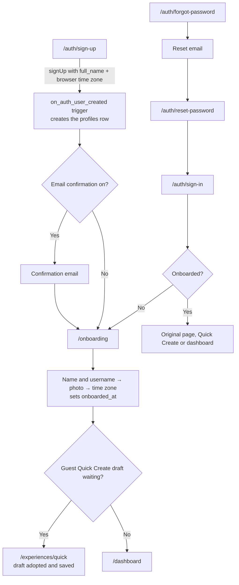

**Flow**

1. **Sign up** (`/auth/sign-up`). This calls `supabase.auth.signUp` with `full_name` and the browser's timezone as user metadata. The `on_auth_user_created` trigger (security definer) creates the `profiles` row and falls back to `UTC` if the timezone is invalid.
2. **Confirm email.** When confirmations are on, the link returns to `/onboarding`. When they are off, the user goes straight there.
3. **Onboarding** has three steps: name and optional username, optional photo, then timezone. Finishing saves the profile and sets `onboarded_at`, then opens `/dashboard`.
4. **Sessions** are persisted by supabase-js in `localStorage` and refreshed automatically. `AuthProvider` listens to `onAuthStateChange`, and signing out clears every cached query.

**Guards** (`src/app/router.tsx`)

- `RedirectIfAuthenticated`: signed-in users on sign-in, sign-up or forgot-password are sent to `/dashboard`.
- `RequireAuth`: guests are sent to `/auth/sign-in` and return to the original page after signing in.
- `RequireOnboarded` / `RequireNotOnboarded`: route users to or away from `/onboarding` based on the profile.

**`public.profiles`**

| Column         | Type          | Notes |
| -------------- | ------------- | ----- |
| `id`           | uuid PK       | references `auth.users(id)` on delete cascade |
| `full_name`    | text          | 1–100 chars, trimmed; required once onboarded |
| `username`     | text          | optional, unique, `^[a-z0-9_]{3,30}$`, lower-cased by trigger |
| `avatar_url`   | text          | object **path** in the private `avatars` bucket (`<user_id>/…`); the client resolves it to a 1-hour signed URL |
| `bio`          | text          | optional, ≤ 280 chars |
| `timezone`     | text          | IANA name validated against `pg_timezone_names`; defaults to `UTC` |
| `onboarded_at` | timestamptz   | null until onboarding is finished |
| `created_at` / `updated_at` | timestamptz | `updated_at` is maintained by a trigger |

**Access rules**

- RLS allows `select` and `update` only where `id = auth.uid()`.
- There are no insert or delete policies, and those privileges are revoked. Rows come from the sign-up trigger and are removed together with the auth user.
- `anon` has no access at all.

**Avatars**

- Images are centre-cropped in the browser to a 512 px WebP, which also strips EXIF data.
- Each image is uploaded to `avatars/<user_id>/avatar-<uuid>.webp`, and the previous file is deleted after the profile row is saved.
- Storage policies only allow a user to touch their own folder.

**Username availability**

- RLS stops users from reading other people's profiles, so availability cannot be checked in advance.
- A taken username is reported on save: the unique index returns `23505`, which is shown on the username field.

### Verifying

1. Apply the migrations by running each file in `supabase/migrations` in numeric order in the SQL Editor.
2. **RLS check:** paste `supabase/verification/profiles_rls_check.sql` into the SQL Editor and run it.
   - It creates two temporary users and impersonates each one (`authenticated` role plus JWT claims), then asserts that:
     - each user can see only their own row;
     - updates to the other user's row affect 0 rows;
     - inserts, deletes and changes to `id` or `created_at` are denied;
     - invalid timezones and avatar paths are rejected;
     - duplicate usernames fail;
     - `anon` is denied.
   - Everything is rolled back. Success is a single result row, `PASS: all profile RLS checks passed`; any failure raises `FAIL: …`.
3. **Manual checklist** (`npm run dev`):
   - Sign up, confirm the email if required, and check that you land on `/onboarding`. Complete it, then check that `/dashboard` greets you by name.
   - In _Table Editor → profiles_, the row has your `full_name`, `username`, `timezone`, `avatar_url` and `onboarded_at`.
   - Reload the page and check that you are still signed in.
   - Sign out from the user menu. Visiting `/dashboard` should now redirect to `/auth/sign-in`, and signing in should return you to the dashboard.
   - While signed in, visiting `/auth/sign-in` or `/onboarding` should redirect to `/dashboard`.
   - Edit your profile in `/settings`, reload, and check that the changes persisted.
   - Try a username that a second account already uses; you should see "already taken".
   - Use _Forgot password_, open the email link, set a new password, and sign in with it.

---

## People

Users keep a private list of the people they care about (`src/features/people`).

**`public.people`**

| Column              | Type        | Notes |
| ------------------- | ----------- | ----- |
| `id`                | uuid PK     | generated by the client on create so the photo can be uploaded to its folder first |
| `user_id`           | uuid        | defaults to `auth.uid()`; not writable by clients; cascades on user delete |
| `name`              | text        | required, 1–100 chars, trimmed |
| `nickname`          | text        | optional, ≤ 60 chars |
| `relationship_type` | enum        | partner, spouse, parent, child, sibling, best_friend, friend, colleague, teacher, relative, other |
| `avatar_url`        | text        | storage **path** `avatars/<user_id>/people/<person_id>/…`, enforced by a check constraint |
| `birthday`          | date        | optional, 1900 or later (the form also rejects future dates) |
| `anniversary_date`  | date        | optional, 1900 or later |
| `notes`             | text        | optional, ≤ 5000 chars |
| `favorite_things`   | text[]      | ≤ 50 items, each ≤ 80 chars; trimmed and de-duplicated (case-insensitive) by trigger |
| `created_at` / `updated_at` | timestamptz | `updated_at` maintained by trigger |

**Access rules:** RLS policies for `select`, `insert`, `update` and `delete` all require `user_id = auth.uid()`. Column grants stop clients from setting `user_id` or the timestamps. `anon` has no access.

**UI**

- The list offers diacritic-insensitive search over name, nickname and favourite things, plus relationship filter chips. Both live in the URL, so they survive reloads and can be shared. A "Coming up" strip shows birthdays and anniversaries in the next 30 days.
- The detail page shows the profile, upcoming occasions (profile dates plus saved occasions for that person, counted in the user's profile timezone), favourite things, notes and their latest memories (with "Add a memory" and "Link from vault"). Past experiences show an honest empty state until that feature exists.
- Photos reuse the private `avatars` bucket. The browser crops them to WebP, and the list loads their signed URLs in a single batch request.
- Deleting a person also deletes their photo and (through the database cascade) their occasions. Their memories stay in the vault, unlinked.

**Verifying:** after running `004_people.sql`, run `supabase/verification/people_rls_check.sql` in the SQL Editor. It should return one row: `PASS: all people RLS checks passed`.

---

## Occasions

The days worth celebrating (`src/features/occasions`).

**`public.occasions`**

| Column                 | Type        | Notes |
| ---------------------- | ----------- | ----- |
| `id`                   | uuid PK     | `gen_random_uuid()` |
| `user_id`              | uuid        | defaults to `auth.uid()`; not writable by clients; cascades on user delete |
| `person_id`            | uuid        | optional; composite FK `(person_id, user_id) → people(id, user_id)`, so an occasion can only link to one of **your** people; cascades when the person is deleted |
| `title`                | text        | required, 1–120 chars, trimmed by trigger |
| `occasion_type`        | enum        | birthday, anniversary, graduation, wedding, engagement, promotion, new_job, farewell, thank_you, mothers_day, fathers_day, valentines_day, friendship, achievement, custom |
| `date`                 | date        | 1900-01-01 to 2200-12-31; for recurring occasions this is the first/original date |
| `recurring`            | boolean     | default `true` |
| `reminder_days_before` | integer     | 0–365 or null (no reminder); default 7 |
| `notes`                | text        | optional, ≤ 2000 chars; blank becomes null |
| `created_at` / `updated_at` | timestamptz | `updated_at` maintained by trigger |

**Access rules:** RLS policies for `select`, `insert`, `update` and `delete` all require `user_id = auth.uid()`. Column grants stop clients from writing `id`, `user_id` or the timestamps. `anon` has no access. The composite foreign key matters because referential checks bypass RLS; without it a user could link an occasion to someone else's person id.

**Recurrence (no duplicated rows)**

- A recurring occasion is stored **once**. Its next date is computed on the client (`recurrence.ts`) in the user's profile timezone, so it appears every future year without extra rows.
- Fixed-date types repeat on the same day; 29 February falls on 28 February in non-leap years.
- Mother's Day and Father's Day repeat on the same *nth weekday* of the month as the saved date (for example the second Sunday of May), because those dates move every year and differ by country. A missing 5th weekday becomes the last one.
- A recurring occasion never shows before its original date; the number of years since then drives "Turns 30" / "5 years".
- One-time occasions that have passed are kept under **Past**.

**Profile dates:** birthdays and anniversaries saved on a person appear automatically as occasions; they are *not* copied into the table. If you save an occasion for the same person, type and day, it replaces the profile entry in lists (useful for a custom name, reminder or notes). Editing a profile entry opens the person's edit page.

**UI**

- `/occasions`: list view (grouped by month, with days remaining) or calendar view (month grid with the locale's first weekday, a selected-day panel and "Add on this day"). The type and person filters apply to both views and live in the URL.
- Dashboard: **Upcoming celebrations** shows the next five occasions ("Rahul's birthday — 7 days") with a **Create surprise** button; the soonest one is also spotlighted in the greeting.
- Every upcoming occasion has a **Create a surprise** button. It opens `/experiences/new?occasion=<key>&person=<id>`, which suggests a title and person and links saved occasions to the new experience.
- Reminders are shown only as in-app dashboard flags for now; nothing is emailed or pushed.

**Verifying:** after running `005_occasions.sql`, run `supabase/verification/occasions_rls_check.sql` in the SQL Editor. It should return one row: `PASS: all occasions RLS checks passed`.

---

## Memory Vault

A private home for photos, videos, voice notes, stories, quotes and links (`src/features/memory-vault`).

**`public.memories`**

| Column        | Type        | Notes |
| ------------- | ----------- | ----- |
| `id`          | uuid PK     | `gen_random_uuid()` |
| `user_id`     | uuid        | defaults to `auth.uid()`; not writable by clients; cascades on user delete |
| `person_id`   | uuid        | optional; composite FK `(person_id, user_id) → people(id, user_id)`, so a memory can only link to one of **your** people. Deleting the person sets it to null (`on delete set null (person_id)`, Postgres 15+), so the memory is kept |
| `type`        | enum        | photo, video, audio, text, quote, link; fixed once created |
| `title`       | text        | required, 1–120 chars, trimmed by trigger |
| `description` | text        | optional (required for text and quote), ≤ 5000 chars; blank becomes null |
| `memory_date` | date        | optional, 1900–2200 (the form also rejects future dates) |
| `location`    | text        | optional, ≤ 200 chars |
| `metadata`    | jsonb       | object, ≤ 4 KB. Media: `storage_path`, `mime_type`, `size`, `width`, `height`, `duration`. Quote: `author`. Link: `url` |
| `created_at` / `updated_at` | timestamptz | `updated_at` maintained by trigger |

**Check constraints** make the metadata trustworthy: photo/video/audio rows must reference `<user_id>/<sha256>.<ext>` inside the owner's own folder with a MIME type matching the memory type; other types can't carry a storage path; links must be `http(s)` and ≤ 2048 chars.

**Access rules:** RLS policies for `select`, `insert`, `update` and `delete` all require `user_id = auth.uid()`. Column grants stop clients from writing `id`, `user_id`, `type` (after insert) or the timestamps. `anon` has no access.

**Storage (`memories` bucket)**

- Private, 50 MB per object, and only image (JPEG, PNG, WebP, GIF, AVIF), video (MP4, WebM, MOV) and audio (MP3, M4A/AAC, WAV, WebM, OGG) MIME types. The app applies tighter per-type limits: photos 15 MB, audio 20 MB, video 50 MB.
- Before a photo is fingerprinted and uploaded, `preparePhoto` (`memory-vault/media.ts`) makes it lighter for mobile networks: JPEG, PNG and WebP photos over 2048 px on the long edge or 1.5 MB are scaled to fit 2048 px and re-encoded (JPEG stays JPEG at 0.85, PNG/WebP become WebP), which also drops EXIF data such as GPS. Animated PNG/WebP, GIF and AVIF are kept as they are, and so is any photo the browser can't make smaller.
- Owners can read and upload only in their own folder, and uploads must use a content-addressed name. There is no update policy, so stored files are immutable.
- Owners can delete a file only when **no memory references it any more**.
- Files are shown through short-lived signed URLs that are requested in one batch and cached in memory.

**No duplicated media**

- Each file is fingerprinted in the browser (SHA-256) and stored at `memories/<user_id>/<hash>.<ext>`, so the same file always gets the same path.
- When a memory already uses that file, the form says so and the new memory simply references it. Nothing is uploaded. If the object exists without a memory, the upload returns 409 and the object is reused.
- Other features (for example the Experience Builder) should reference memories by id through `MediaPicker`, not copy files.
- Uploads happen on **save**, not on selection, so abandoned forms leave no files behind. If the row insert fails, a file that this save uploaded is removed again. Deleting a memory also removes its file, unless another memory still uses it.

**UI**

- `/memory-vault`: a timeline grouped by year in a masonry grid. You can filter by type (with counts), by person (or "not linked") and by search text, and sort newest or oldest first. Undated memories come last. Filters live in the URL.
- Opening a memory shows a full viewer with playback, details, previous/next (also with the arrow keys), edit and delete.
- The add form lets you pick a type or drop a file. Dropping a file switches to its type. The form checks type and size, shows a local preview and the dimensions or duration, flags reused files, shows upload progress with a Cancel button, and maps errors to their fields.
- **`MediaPicker`** (`components/MediaPicker.tsx`) is a reusable dialog for choosing memories. It supports search, person and type filters, single or multiple selection, `types`, `excludeIds`, `initialSelectedIds` and `maxSelection`. It returns the chosen `Memory` rows. Person pages use it for **Link from vault**.
- With `addTypes` (and optionally `initialAddMode`), the picker also offers **Upload**, **Take a photo** and **Record a video** (`components/NewMediaMemory.tsx`, `new-media.ts`). The new file goes through the same checks, fingerprinting, dedupe and private upload as the add form, and is saved as a real memory (with a title) before it is returned. If the file is already in the vault, that memory is reused.
- **`CameraCapture`** (`components/CameraCapture.tsx`) uses `getUserMedia` for a live preview. Photos are saved as JPEG from a canvas. Videos are recorded with `MediaRecorder` (MP4 where supported, otherwise WebM), up to 2 minutes and inside the 50 MB limit. Tracks stop when you leave. It needs HTTPS (or localhost) and camera/microphone permission. “Use your device’s camera app” (`<input capture>`) is the fallback, and on phones it opens the native camera.

**Verifying:** after running `006_memory_vault.sql`, run `supabase/verification/memories_rls_check.sql` in the SQL Editor. It should return one row: `PASS: all memories RLS checks passed`. Storage policies are checked structurally there. Check uploads by hand: add the same photo twice (the second time should say it's reused), and delete one memory (the file should stay until the last memory using it is deleted).

### Turn memories into a story

On `/memory-vault`, **Turn memories into a story** (shown when the `story_generation` AI task is available) lets you pick 2–20 memories. You then choose a tone (heartfelt, funny, playful, emotional) and a length (short, medium, long), and the AI connects them into a titled story with an introduction, sections (each built on one or more memories, with a caption per memory) and a closing.

- **What is sent:** only the chosen memories' titles, descriptions, dates, places and linked people's names, under refs `m1`–`m20` (`memory-story.ts`, `buildStoryBrief`). Ids, files, signed URLs and link addresses are never sent, and the AI can't see media.
- **No invented facts:** the prompt (`supabase/functions/_shared/ai/memory-story.ts`) forbids new events, names, people, dates, places or conversations, and asks that added language read as feeling rather than fact. Refs the model makes up are dropped, and a reply with no usable section is rejected.
- **One request, one usage event:** `ai-generate` accepts `{ story: brief }` and runs `story_generation` with a single attempt (no fallback). The app never retries by itself. If the save fails after writing, **Save my story** saves the draft without another request.
- **Editing:** every title, paragraph, heading and caption can be edited. Text is marked **Written with AI** until you change it (then **Edited by you**), and each memory's saved details are shown read-only as **From your memories**. **Regenerate** asks for confirmation, replaces the text and edits, and uses one request.

**`public.memory_stories`**: `title` (1–120), `content` (jsonb: `generated`, `introduction`, `sections[{id, heading, text, memory_ids, captions}]`, `conclusion`, `edited`; ≤ 64 KB), `memory_ids` (2–20), `tone`, `length`, `generated_at` (set by trigger when the story is written or regenerated). Owner-only RLS; clients can't write `user_id`, `generated_at` or the timestamps.

**Verifying:** after `019`, run `supabase/verification/memory_stories_check.sql`. It should return `PASS: all memory story checks passed`.

---

## Experiences (data layer)

The database architecture for interactive celebrations (`src/features/experiences`). The visual editor is described in [Experience Builder](#experience-builder).

**Tables**

| Table | Key columns | Notes |
| ----- | ----------- | ----- |
| `experiences` | `user_id` (owner), `person_id`, `occasion_id`, `title`, `description`, `status`, `visibility`, `cover_image_url`, `theme_id`, `scheduled_at`, `published_at` | Person and occasion use composite FKs to the owner's own rows and are unlinked (`on delete set null`) when those are deleted. `title` 1–120, `description` ≤ 2000, `theme_id` is an app theme slug. `cover_image_url` is a **path** in the owner's `memories` bucket (`<user_id>/<sha256>.<ext>`), not a copy |
| `experience_pages` | `experience_id`, `position`, `title`, `background` (jsonb) | Ordered screens. `background` is an object ≤ 8 KB, e.g. `{"color": …}` or `{"memory_id": …}` (photo/video) |
| `experience_blocks` | `page_id`, `type`, `position`, `content` (jsonb), `settings` (jsonb) | `type` is one of text, image, video, audio, button, divider, countdown, reveal, quote, question, quiz, puzzle, memory, message and is fixed after insert. `content` (≤ 64 KB) is what's shown, `settings` (≤ 16 KB) is how it behaves, including expected answers |
| `experience_recipients` | `experience_id`, `name`, `email`, `phone`, `access_token`, `opened_at`, `completed_at` | Name trimmed, email lower-cased and unique per experience, phone reduced to `+digits`. `access_token` is 64 random hex characters generated by the database; `short_code` is the 7-character code used in `/x/<code>` links |
| `experience_contributors` | `experience_id`, `user_id`, `role` | `editor` or `viewer`; one row per user; the owner can't be added |

**Access (RLS + column grants)**

| | Owner | Editor | Viewer | Anyone else |
| - | :-: | :-: | :-: | :-: |
| See the experience, pages, blocks, team | ✓ | ✓ | ✓ | – |
| Edit title, description, cover, theme | ✓ | ✓ | – | – |
| Add, edit, reorder, delete pages and blocks | ✓ | ✓ | – | – |
| Change status, schedule, visibility, person, occasion | ✓ | – | – | – |
| Delete the experience | ✓ | – | – | – |
| See and manage recipients (contact details, link tokens) | ✓ | – | – | – |
| Invite, re-role, remove contributors | ✓ | – | – | – |
| Leave | – | ✓ | ✓ | – |

- Policies go through `SECURITY DEFINER` helpers in a non-exposed `private` schema (`owned_`, `shared_`, `viewable_`, `editable_experience_ids()`), so tables can check each other without RLS recursion.
- Owner-only columns on `experiences` are enforced by a trigger, because owners and editors share the same database role.
- Clients can never write `user_id`, `published_at`, positions on insert, `access_token`, `short_code`, `opened_at`, `completed_at` or the timestamps. `anon` has no access to any of these tables.

**Lifecycle:** new experiences start as `draft`. `scheduled` requires a future `scheduled_at`. Publishing sets `published_at`. `archived` hides it from active use. Migration `010` adds the full state machine and automatic opening at `scheduled_at` (see [Scheduling and Surprise Drop](#scheduling-and-surprise-drop)).

**Ordering:** new pages and blocks are always appended (under an advisory lock, max 100 per experience/page). `reorder_experience_pages(experience_id, page_ids[])` and `reorder_experience_blocks(page_id, block_ids[])` take the complete new order and renumber positions in one statement. A stale list is rejected.

**Media is referenced, never copied:** blocks and page backgrounds point to Memory Vault memories by `memory_id`. A trigger checks that the memory belongs to the experience's owner, and that image/video/audio blocks use a memory of that kind. A file used as a cover can't be deleted from storage, and contributors can read covers of experiences they can see. Button links must be `http(s)`.

**TypeScript**

- `api/experiencesApi.ts`, `api/contentApi.ts`, `api/sharingApi.ts`: typed data-access functions. Field types are `Pick`s that match the column grants.
- `blocks.ts`: `BLOCK_TYPES`, per-type `BlockContentMap` / `BlockSettingsMap`, `newBlock(type)` and `readBlock(block)`.
- `hooks/useExperiences.ts`, `hooks/useExperienceContent.ts` (reordering is optimistic with rollback), `hooks/useExperienceSharing.ts` (including `useExperienceRole`).

**Built on top of this layer later:** recipient viewing through token-checked RPCs that strip answers (`008`), shared media for recipients (`008`), scheduling and automatic opening (`010`), friend contributions through invite links (`012`) and payments (`020`).

**Still open:** inviting collaborators (editors and viewers) by email; the API takes a user id.

**Verifying:** after running `007_experiences.sql`, run `supabase/verification/experiences_rls_check.sql` in the SQL Editor. It uses an owner, an editor, a viewer and a stranger, and should return one row: `PASS: all experiences RLS checks passed`.

---

## Experience Builder

A visual storytelling editor on top of `experience_pages` and `experience_blocks` (`src/features/experience-builder`). No new SQL is needed.

**Layout**

- **Top:** back link, editable title, save status, status badge, **Theme**, **Preview**, **Schedule** and **Publish** / **Unpublish**.
- **Left:** block library in four groups: Content (text, image, video, audio), Interactive (question, quiz, puzzle, reveal), Emotional (memory, quote, message) and Utility (countdown, button, divider).
- **Centre:** the live canvas, with page tabs and **Add page**.
- **Right:** properties for the selected block, or for the page (title, background), the theme and the experience description. **Theme** opens the theme picker here.
- **Below `lg`:** the canvas fills the screen. The library and properties open as bottom sheets from a bottom bar, and each block gets an **Edit** button.

**Editing**

- You can add a block by clicking it in the library or dragging it onto the canvas.
- Each block can be edited, duplicated, moved up or down, deleted (with confirmation) and reordered by dragging. The keyboard works too: `Alt+↑/↓` moves the focused block and `Delete` removes it.
- Drag and drop uses native HTML5 events (`dnd.ts`), so no library is needed.
- The first page of a new experience is created automatically.
- Images, videos, audio and memories come from the vault through `MediaPicker`. Blocks store only `memory_id`. For photo and video slots (Image, Video, Memory, Reveal and the puzzle picture), `MediaField` also offers **Upload**, **Take a photo** and **Record a video**. The file is saved to the vault first and then selected for the block.

**Autosave** (`hooks/useAutosave.ts`)

- Edits to the title, description, page settings and block content are debounced per item (800 ms). Only one save runs per item at a time, and newer drafts win.
- Pending saves are flushed before status changes, when the editor unmounts and when you navigate away. A warning is shown if you try to close the tab with unsaved changes.
- Errors show in the header with **Retry**.
- Structural changes (add, duplicate, delete, reorder) go straight to the database. They run one at a time, in order, using the reorder RPCs.

**One renderer for every mode** (`src/features/experiences/renderer`)

- `BlockView` looks up each block type in a typed registry of block components.
- `PageSurface` draws page backgrounds, and `ExperiencePlayer` steps through pages one at a time.
- The builder canvas (`mode: 'edit'`), the preview (`'preview'`) and the future recipient page (`'live'`) all use these same components.
- What differs between modes is supplied through `ExperienceRuntimeContext`:
  - the render mode
  - resolved memories and their signed URLs
  - `submitAnswer`
  - `pages`, `nextPage` and `goToPage`
- The preview checks answers locally. The recipient runtime must check them on the server.

**Blocks** (`renderer/blocks/*`, editors in `experience-builder/components/BlockSettings.tsx`)

Every block reads `experience_blocks.content` / `settings` defensively (`renderer/values.ts`), because stored JSON isn't validated field by field. Types and defaults live in `src/features/experiences/blocks.ts`. In edit mode, empty blocks show a dashed placeholder; for recipients they render nothing.

| Block | `content` | `settings` | Notes |
| --- | --- | --- | --- |
| Text | `text` | `size` (body, lead, title), `align` | A title renders as an `h2`. |
| Image | `memory_id`, `caption`, `alt` | `fit` (cover, contain), `aspect` (landscape, square, portrait) | Photo from the vault. Intrinsic sizes reserve space. |
| Video | `memory_id`, `caption` | `autoplay` (muted), `loop` | Uses the video's own aspect ratio, capped at 70vh. |
| Audio | `memory_id`, `caption` | `autoplay`, `loop` | Shows the recording's duration. |
| Quote | `text`, `author` | `align` | |
| Button | `label`, `url` | `action` (next_page, page, link), `page_id`, `variant`, `full_width` | Recipients don't see buttons that can't go anywhere. |
| Divider | – | `style` (line, flourish, space) | |
| Countdown | `target_at` (ISO), `label`, `ended_text` | `show_target` | Updates every second, then shows `ended_text`. |
| Memory | `memory_id`, `note` | `show_date` | Any memory type: photo, video, audio, story, quote or link. |
| Message | `greeting`, `text`, `from` | `style` (letter, card, note) | |
| Reveal | `teaser`, `text`, `memory_id` | `gesture` (tap, hold, scratch) | The hidden content stays `inert` until the recipient interacts. Scratch is a canvas cover (`ScratchCard.tsx`) that clears at 50%. Keyboard users get a "Reveal without scratching" button. |

**Validation** (`src/features/experiences/validation.ts`)

- `validateBlock` returns errors (the block is empty or broken for recipients) and warnings (worth a second look). Examples: missing or deleted memories, the wrong memory type, invalid links, buttons that point at a deleted page, and countdowns in the past.
- Issues are listed at the top of the block's settings. Blocks with errors get a **Needs attention** badge, and their page tab gets a dot.
- Publishing is still allowed, but the dialog says how many blocks need attention.
- The database remains the source of truth. It enforces JSON object shape and size, http(s) button links, and memory ownership and type.

**Publishing:** Publish sets `published`, and Schedule sets `scheduled` with a future `scheduled_at` in your local time. Unpublish returns the experience to `draft`. Only owners can change status.

**Themes** (`src/features/experiences/themes`)

- 11 structured themes in `themes.ts`: Elegant, Romantic, Birthday, Friendship, Funny, Minimal, Celebration, Family, Graduation, Wedding and Dark cinematic. Each one defines typography (display, body and accent fonts), background, colours, card styling, border radii, button styling, spacing, a motion style, decorative elements and confetti.
- Themes are app configuration, not data. The chosen theme's slug is saved in `experiences.theme_id` (autosaved); unknown or empty slugs fall back to Elegant. New experiences start in a theme suggested by their occasion (`theme-suggestions.ts`).
- `PageSurface` turns the theme into `--x-*` CSS variables (`surface.ts`), loads its Google Fonts on demand (`fonts.ts`) and draws its decorations (`ThemeDecor.tsx`). Blocks read the variables through the `x-card`, `x-feature`, `x-photo`, `x-button`, `x-option` and `x-accent-font` utilities in `src/styles/experience.css`, so every block restyles itself.
- A page's own background colour still wins; **Theme default** in page settings returns it to the theme background. Text, accents and buttons adapt when a light theme gets a dark page (and vice versa).

**Animations** (`themes/motion.ts`, `renderer/motion`, `renderer/CelebrationLayer.tsx`)

- Each motion style (graceful, tender, lively, playful, still, cinematic) is a preset for page transitions, text reveal (word by word), image entrance, block entrance and the surprise reveal.
- Confetti (canvas-confetti, in the theme's colours and shapes) marks surprise reveals, correct answers and countdowns that reach zero. It draws on a canvas inside the player, and its code loads only on the first celebration.
- Floating decorations animate only `transform` and `opacity`.
- Everything respects `prefers-reduced-motion`: Motion is set to `reducedMotion="user"`, confetti is skipped, decorations stand still and text appears at once. The canvas in edit mode stays still.

**Not built yet**

- Real-time collaboration, and editing by `editor` collaborators in the builder (they currently see a "coming soon" screen).
- Word-search puzzles (riddle puzzle blocks and the photo jigsaw scene are playable).
- Moving blocks between pages.

AI generation, scheduling and staged unlocks have since been built: see [AI editing in the builder](#ai-editing-in-the-builder), [AI infrastructure](#ai-infrastructure) and [Scheduling and Surprise Drop](#scheduling-and-surprise-drop).

---

## Interactive blocks and recipient responses

**Blocks**

| Block | Sender sets | Recipient sees |
| --- | --- | --- |
| Question | `content.prompt`, `placeholder`; optional expected `settings.answer` (+ `case_sensitive`) | An open answer box (up to 1000 characters). Without an expected answer, any reply is accepted. |
| Quiz | `content.question`, `options`; optional `settings.correct_index` and `explanation` | The choices. A wrong pick shakes and can be retried; the right one gets a success badge and the explanation. |
| Puzzle | `content.prompt` (clue), optional `hint` and picture clue; `settings.solution` (required) and optional `success_message` | A guess box, a hint button, and a solved panel with the success message. |

Correct answers get a spring-in badge with a drawn tick, a ring pulse and (for puzzles) confetti; wrong answers shake. All of it honours `prefers-reduced-motion`.

**Recipient flow**

1. The owner opens **Share** (on My Experiences or in the builder header), adds a recipient by name, and copies their personal link `/x/<code>`. Adding the first recipient switches visibility to `recipients`.
2. The link works while the experience is published (or scheduled and due) and visible to recipients. Unpublishing or removing the recipient closes it.
3. The recipient page talks only to security-definer RPCs; `anon` has no table access. `open_recipient_experience` returns the pages with expected answers, explanations and success messages stripped out, plus the recipient's earlier progress. `submit_recipient_answer` checks the answer on the server and only then returns the feedback.
4. Reaching the last page marks the recipient as finished.

**What's stored** (`experience_interactions`: `id, experience_id, page_id, block_id, recipient_id, interaction_type, response, created_at`)

- Question: the answer text (and whether it was right, if an answer was expected).
- Quiz: the chosen index and option text, and whether it was right.
- Puzzle guesses: only whether each guess was right; the guessed text isn't kept. Hints: one row per puzzle, no content.
- No IP addresses, user agents or other identifiers. Rows are deleted with their recipient, block, page or experience. Each recipient has at most 50 attempts per block.
- Only the owner can read (and delete) responses; nobody can edit them.

**Responses:** the Share page lists every question, quiz and puzzle in page order with each recipient's latest answer, tries, and hint use. Each person is labelled **In progress** or **Finished**, and the page refreshes every 20 seconds while it's open.

**Verifying:** after running `008_experience_interactions.sql`, run `supabase/verification/interactions_rls_check.sql` in the SQL Editor. It should return one row: `PASS: all interactions checks passed`.

**Not built yet:** word puzzles, and email/SMS delivery of links. (AI puzzle and quiz generation are in [AI editing in the builder](#ai-editing-in-the-builder); the photo jigsaw is an [interactive scene](#interactive-scenes).)

## Recipient experience

Recipients open `/x/<code>` without signing in. The code is 7 letters and digits (about 3.5 trillion possibilities), generated by the database and unique across recipient and invite links. The page first calls `resolve_short_link('recipient', code)` to get the 64-hex access token and then works with the token as before. Anything that isn't a valid code or token shows the "on its way" screen without calling the server. After 30 unknown codes in 15 minutes from one IP address the resolver refuses further lookups (HTTP 429) and the page says to try again later. Older `/experience/<64-hex token>` links still work.

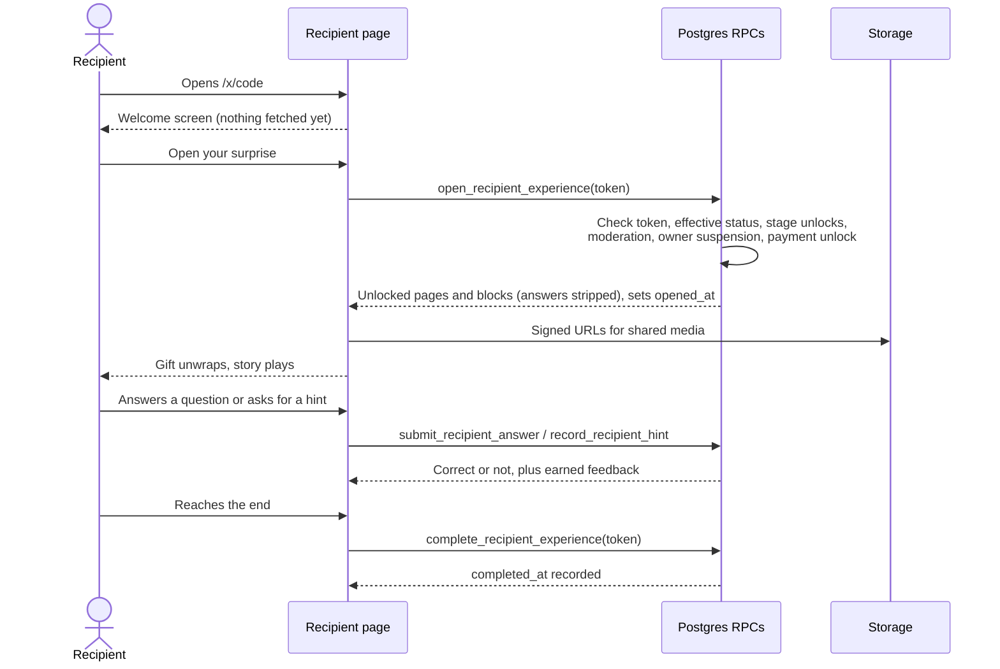

- **Welcome screen:** "Someone created something special for you ❤️" with a floating gift and an **Open your surprise** button. Nothing is fetched and `opened_at` isn't set until they tap it, so link previews and prefetchers don't count as a visit. The tap also lets audio and video play with sound.
- **Unwrapping:** the gift shakes, the lid flies off and sparks burst while the experience loads, then the pages fade in. With reduced motion, it opens straight away.
- **Playing:** `ExperiencePlayer` in live mode renders the pages one after another, with page transitions, the theme, and every block (reveals, video, audio, countdowns, questions, quizzes, puzzles). There are no editing controls. Answers are checked on the server, earlier progress is restored, and reaching the last page sets `completed_at`.
- **Privacy:** the page talks only to the token-checked RPCs; `anon` has no table access, and answers, explanations and success messages never reach the browser before they're earned. Media uses short-lived signed URLs. The page adds `noindex, nofollow`, and the app sends `strict-origin-when-cross-origin` referrers, so the token doesn't leak to linked sites.
- **If the link is closed** (unpublished, private, cancelled, or the recipient was removed), they see "Something special is on its way." If the network fails, the button changes to **Try again**.
- **Story controls:** the bottom bar has Back, a sound toggle (sound is off until they turn it on), **Skip** on skippable scenes, **Replay** on finished scenes that allow it (template finales and letters do), **Continue** once the scene is complete, and **Start over** at the end. Every gesture (drag, swipe, hold, scratch) has a tap or keyboard alternative, and reduced motion is respected throughout.
- **Loading:** photos pulse softly until they arrive, and missing or failed media shows "This can’t be shown right now" instead of a broken image. The next scene's photos are fetched while the current one plays.
- **Keyboard:** when the button just used disappears or is disabled (Skip, Replay, Continue, an opened gate), focus moves to **Continue** if the scene is complete, otherwise to the story itself, so it never drops to the top of the page.

**Recipient playthroughs** (`tests/recipient-flow.test.ts`) build one template per major category (birthday, romantic, friendship, anniversary, graduation, thank-you, farewell) as a creator would, strip the settings the way `open_recipient_experience` does, and walk every route (every answer of branching questions). They check each route opens with a welcome, passes the expected scenes and interactions, can be completed without the hidden answers, ends in a replayable finale, and resumes after a refresh.

**Sharing (sender side):** after **Publish** or **Schedule** in the builder, an "It’s live!" (or "It’s scheduled!") dialog shows each recipient's private link with **Copy link** and **Share**. If there's no one yet, it asks who it's for (pre-filled from the person) and creates their link, turning recipient links on if the experience was private. It also explains that anyone with a link can open it, that opening it yourself counts as their visit (use Preview), and that edits keep showing up after publishing. The Dashboard shows **Drafts**, **Scheduled surprises** and **Recently completed** (who finished what); each recipient's progress and **Copy link** / **Share** buttons are on the Share & responses page. **Share** uses the device share sheet where there is one. The same buttons are on the Share & responses page. The owner can't open a recipient's link from the app, because opening it counts as the recipient's visit.

## Scheduling and Surprise Drop

**Status state machine** (enforced by the `prepare_experience` trigger, not the browser):

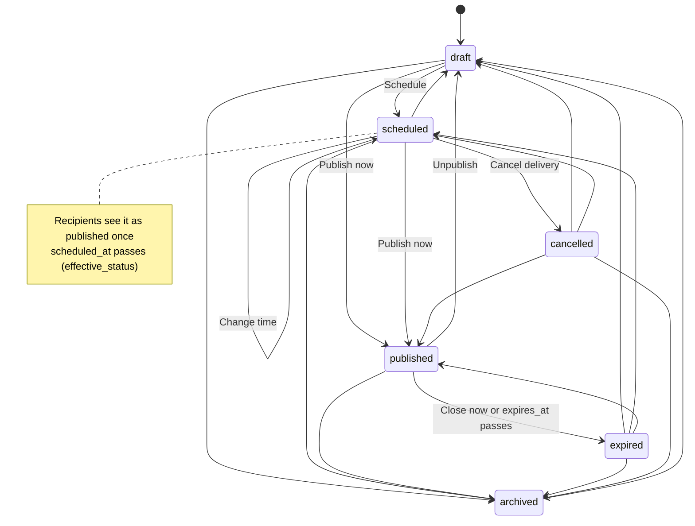

| From | Allowed to |
| --- | --- |
| `draft` | `scheduled`, `published`, `archived` |
| `scheduled` | `scheduled` (edit time), `published` (publish now), `cancelled`, `draft`, `archived` |
| `published` | `expired` (close now), `draft` (unpublish), `archived`; end time can be edited |
| `expired` / `cancelled` | `draft`, `scheduled`, `published`, `archived` |
| `archived` | `draft` |

**Ending an experience:** on **My Experiences**, each scheduled or live experience has **Set expiry** (the calendar icon): pick an end time, clear it, or (when live) **End it now**. Each card also has **Delete**. Admins can do the same for any experience in **Admin → Experiences** (see [Admin console and payments](#admin-console-and-payments)).

- `scheduled_at` and `expires_at` must be in the future when set. `schedule_timezone` must be a real IANA zone and is only used to show the time the sender picked.
- **Nothing opens early.** `private.effective_status()` treats a scheduled experience as published only once `scheduled_at` has passed (and a published one as expired once `expires_at` passes). Every recipient RPC, the memory access helpers and the storage policy use it, so no cron job is needed for correctness. The first recipient visit records the change; `release_due_experiences()` (service role only) does it in bulk. An optional pg_cron snippet is in the 010 comments.
- **Builder:** **Publish** and **Schedule** open one dialog. It has Now/Later, date, time, time zone, an optional "available until", a preview (the time in your zone and your browser's, the drop timeline and any warnings), and a confirmation step. A scheduled experience shows **Scheduled**, where you can change the time, publish now or **Cancel delivery**. A live one shows **Timing**, where you can set the end time or close it now.

**Surprise Drop:** **Drop** in the builder header adds up to 9 later stages after Stage 1, each with an optional title and an unlock date and time. The last of two or more is called "Final surprise". Each page belongs to a stage: pick it in **Page settings**, or tap a stage chip in the page tabs. New pages join the stage you're on. Removing a stage moves its pages to the stage before it.

- Recipients only receive pages, blocks and media of stages that have unlocked, and answers and hints on locked pages are rejected. Completion is recorded only after the last stage is open.
- The last open page ends with **"Your next surprise arrives in…"** (or **"Your final surprise arrives in…"**) and a live countdown. At the moment of unlock, the page refetches by itself, jumps to the new stage's first page and shows "Your next surprise is here". Countdowns use the server's clock, and timers are capped at an hour and re-armed, so a sleeping device doesn't miss the moment.
- A link opened before its scheduled time shows **"Your surprise arrives in…"** with a countdown and opens by itself when the time comes. A closed (expired) link shows "This surprise has closed."

**Verifying:** after running `009` and then `010`, run `supabase/verification/scheduling_check.sql`. It should return `PASS: all scheduling checks passed`.

**Not built yet:** email and SMS delivery at the scheduled time. Links are still shared by the sender.

## Collaborative contributions

A creator can invite friends to add to an experience. Open **Friends** in the builder header (or **Contributions** on the Share & responses page).

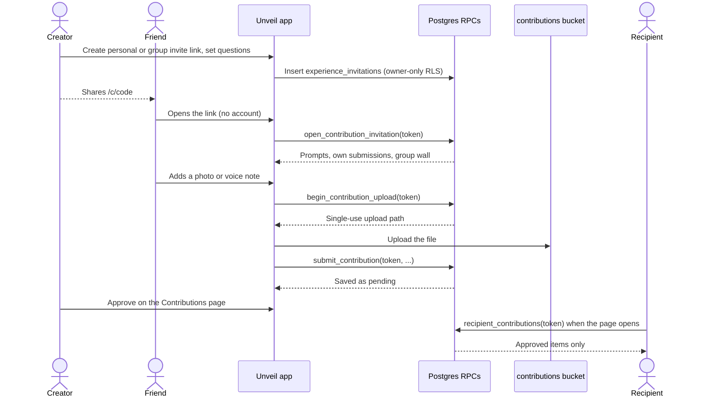

- **Invitations:** each friend gets their own link (`/c/<7-character code>`, resolved to the invite token by `resolve_short_link('invitation', code)`; older `/contribute/<64-hex token>` links still work) with a name, an optional email (for the creator's records only; nothing is emailed) and a closing date (7 to 90 days, up to a year). A link can be turned off and back on, reopened after it expires, or deleted. Deleting it also deletes everything that friend sent, files included.
- **Contributing needs no account.** A friend can send a message, photo, video, memory (story, optional title and photo), an answer to one of the creator's questions (up to 10), or a voice message (recorded in the browser, or an audio file). They see only their own submissions and whether each was included. They never see the experience, other contributions or anyone's email.
- **Approval:** everything starts as **Pending**. On the Contributions page the creator can **Approve**, **Reject** (or **Hide** an approved one) or **Delete** it. Only approved contributions appear, in the **Contributions** block (Emotional category). That block has an optional heading and a "friends have contributed" count (for example "8 friends have contributed"). Recipients receive approved contributions only once the block's page (and stage) is open.
- **Limits, enforced in the database:** 200 invitations per experience, 20 submissions and 40 files per invitation, 5 unfinished uploads at a time, and files up to 50 MB in the same formats as the Memory Vault.
- **Security:** the three tables are owner-only under RLS. Contributors and recipients go through security-definer RPCs that check the token and return only what's needed. Uploads need a single-use path from `begin_contribution_upload`, and `submit_contribution` checks that the file exists and matches the chosen kind. Media is read through signed URLs: by the owner, by the contributor only until the upload is used, and by recipients only for approved items of a live, shared experience.
- **Known gap:** a file uploaded but never submitted stays in storage. The ticket limits cap how many such files there can be.

**Verifying:** after running `011` and then `012`, run `supabase/verification/contributions_check.sql`. It should return `PASS: all contribution checks passed`.

### Group link (migration 018)

Besides personal links, the creator can make **one group link** per experience (the *Group link* card above *Invite friends*) and post it in a group chat.

- Anyone with it adds their own name, then sends as many messages, photos, videos, memories, answers and voice notes as they like. The device remembers the name and marks their own items "You" (`localStorage`, `unveil:group-link:<token prefix>`).
- They see the **group wall**: who has added what, with the kind and the first 140 characters. Files are never shown to the group, and rejected items leave the wall. Review status is shown only on their own items.
- Limits: 300 contributions, 400 files and 20 unfinished uploads for the group link (personal links keep 20, 40 and 5).
- Counting: each name on the group link counts as one friend in the progress bar, the Group Secret dashboard and the recipient's "friends have contributed" count.
- The link can be turned off and on, reopened or deleted like a personal link. `shared` is set only when the link is created.

**Verifying:** after `018`, run `supabase/verification/group_link_check.sql`. It should return `PASS: all group link checks passed`.

**Not built yet:** automatic AI compilation of contributions, and emailing invitations.

## Group Secret

A collaborative surprise that stays hidden from the recipient until a reveal time, for example "Rahul's 30th Birthday". Turn on **Group Secret** when creating the experience (or later from the Contributions page). The builder header's **Secret** button opens the dashboard.

- **Dashboard (owner only):** contributors, pending and approved counts, a completion bar ("7 of 10 friends have contributed"), the list of friends, and a live countdown to the reveal. From there the creator sets or changes the reveal date, time and time zone, reveals it straight away, or cancels the reveal.
- **Before the reveal:** friends contribute through their links and see the group's progress and reveal time, but never the experience or other people's contributions. The recipient's link behaves exactly like an invalid link: no countdown, no title and no hint that anything exists. Editors keep working on the experience; viewer collaborators can't see it.
- **At the reveal:** the reveal is the experience's scheduled time, so it opens by the same release as any scheduled experience (`private.effective_status`). Contributions stay open afterwards.
- **Security policies (migration 013):**
  - `private.is_unrevealed_secret` is true for a secret whose effective status isn't `published` or `expired`.
  - `open_recipient_experience` returns null for an unrevealed secret before recording `opened_at`, and `private.recipient_access` (which the response, reaction and contribution RPCs use) excludes it. So nothing can be opened, answered or read.
  - `private.shared_experience_ids` and `private.viewable_experience_ids` only include viewer collaborators once it's revealed, which hides the experience, its pages, blocks, team and invitations under RLS.
  - A trigger lets only the owner change `group_secret`, so an editor can't expose it early. Publishing is already owner-only.

**Verifying:** after `013`, run `supabase/verification/group_secret_check.sql`. It should return `PASS: all group secret checks passed`.

## Interactive scenes

Any page can become a **scene**: one step of an interactive story. As soon as one page of an experience is a scene, the experience plays as a story, one scene at a time. Experiences without scenes use the original page player, unchanged.

- **No migration.** A scene is stored as `experience_pages.background.scene` (the same jsonb column as the page colour, within its 8 KB limit). `open_recipient_experience` already returns the whole background. The scene's content is ordinary blocks, and answers go through the existing answer RPCs.
- **Scene types:** welcome, animation, interaction, message, photo, question, puzzle, timeline, letter, flip cards, hidden hunt, choose-a-surprise and final reveal. An unknown stored type shows a friendly "unsupported" scene rather than failing.
- **Settings (Page settings → Interactive scene):**
  - Title and subtitle.
  - Interaction: tap, envelope, gift, treasure chest, balloons, a stretch-and-release party popper, a virtual bow, cake and candles, a photo puzzle, a piñata, a prize wheel, connect-the-stars or a combination lock, with a count and call to action.
  - Balloon messages: one optional line per balloon ("what you mean to me"), shown as its balloon pops and again with the scene's content afterwards. They're stored as `scene.interaction.messages` (index-aligned with the balloons, at most 12 of 140 characters). The builder offers an example for each balloon (*Use examples*) and, when AI is available to the user, a sparkle button per balloon plus *Write the empty ones with AI*. Stars and wheel slices use the same messages and editor (`SceneMessagesEditor`), with wishes and prizes as examples.
  - Piñata (`pinata`): a star piñata on a rope. Each tap whacks it (it swings and cracks, with a "Bam!"); after the count of whacks (1 to 12) it bursts into sweets and the scene's blocks appear.
  - Prize wheel (`wheel`): 2 to 8 slices, each a prize message. Every spin lands on a slice not yet won, so each prize comes up once; the scene opens when all are won. A blank slice says "Surprise!". Geometry is in `renderer/scenes/interactions/wheel.ts`.
  - Connect the stars (`stars`): 3 to 12 stars around a heart in a night sky. They tap each glowing star in turn; lines draw between them, each star shows its wish, and the heart closes with a shooting star (`constellation.ts`).
  - Combination lock (`lock`): one dial per digit of `scene.interaction.code` (2 to 6 digits, stored as digits only). Put the clue in the subtitle. A wrong try shakes the lock and says how many digits are right; *Hint* sets one dial after the first try and *Open it for me* appears after three. Without a code it's shown open. Rules are in `lock.ts`.
  - Photo puzzle (`jigsaw`): the scene's first photo is cut into 2 × 2, 3 × 3 or 4 × 4 pieces (the count), shown whole, then shuffled. Tap two pieces to swap them. A reference thumbnail, *Hint* (always places a piece) and *Solve it for me* mean nobody gets stuck, and the scene's blocks (the photo and a wish) appear once it's whole. The creator uploads or takes the photo in a photo block. Rules are in `renderer/scenes/interactions/jigsaw.ts`.
  - Colours: a safe preset (theme, rainbow, strawberry, ocean, sunshine, mint, lavender or chocolate) for balloons, candles, cake, gift, chest, popper, piñata, wheel and lock. It's stored only when not the theme's own, and unknown values fall back to the theme (`renderer/scenes/palette.ts`).
  - Background decor, the item label for cards, hunts and choices, and whether answers are optional.
  - Transition: theme, fade, slide, zoom, pop or confetti.
  - Advance with a Continue button or by itself after a delay.
  - Skippable, replay, progress (dots, bar or hidden) and a per-scene theme.
  - Next scene, and branches per option of the scene's first multiple-choice question. Branches work best when no answer is marked correct.
- **Code:**
  - Configuration, parsing, validation and routing: `src/features/experiences/scenes/config.ts`.
  - Renderers: `renderer/scenes/SceneView.tsx`, a registry of layouts per type with an error boundary per scene.
  - Interactions: `renderer/scenes/interactions/`.
  - The story player: `renderer/scenes/StoryPlayer.tsx`. `ExperiencePlayer` picks the story player or the page player.
- **Completion:** a scene is done once its interaction is finished, its letter has typed out, its photos have been revealed and its questions have been answered. Continue stays disabled until then, and Skip (if enabled) finishes the scene at once.
- **Accessibility:**
  - Every interaction works with a tap or the keyboard.
  - The popper can be dragged with a pointer or touch without scrolling the page, or just tapped.
  - The bow is aimed by dragging the arrow back (the pull and angle are clamped in `bow-aim.ts`). Aim is generous, a tap or key press always hits, and after one miss the next shot can't miss.
  - The cake never uses the microphone: tap each candle, or *Blow them all out*.
  - Reduced motion shortens the animations and shows letters whole. Letters type by grapheme, so emoji never appear half-typed.
- **Sound:** on by default, with a Sound on/off toggle in the story's bottom bar (remembered in `localStorage` as `unveil:sound`). Effects (pop, whoosh, chime, puff, open, tick, thud) are synthesized with the Web Audio API in `renderer/sound.ts`; there are no audio files.
- **Background music:** every scene has a mood (Page settings → *Background music*): `auto` picks one from the scene type and interaction (`sceneMusic` in `scenes/config.ts`), or choose party, playful, romantic, tender, dreamy, nostalgic, mystery, adventure, celebration, calm or none. The music is generated on the device (`renderer/music.ts`), follows the Sound toggle, is silent in the builder, and `auto` stays quiet on scenes with their own audio or video.
- **Stickers:** an optional cartoon above the scene title (Page settings → *Sticker*): a sorry cat with a flower, love, shy, thanks, teary, cake and waving cats, and party, cool, graduate, trophy and pleading dogs. They're original SVG drawings (`scenes/stickers.ts`).
- **Playful interactions:**
  - Yes or no (`yesno`): a question where *No* runs away, shrinks and pleads each time they go for it (the plea lines are the scene's messages), until only *Yes* is left. Yes sets off a celebration, then the scene opens.
  - Knock knock (`door`): knock on the door 1 to 5 times; it swings open onto a surprise.
  - Tree of hearts (`tree`): a tree grows, 3 to 12 heart buds appear, and each one tapped blooms with a planned activity ("Picnic by the lake"). The full tree showers hearts.
  - Sign & stamp (`agreement`): an agreement with 1 to 8 promises. They scribble a signature (or tap to sign), agree, and a red **APPROVED** stamp slams down.
- **Timeline scenes** scroll sideways: one card per memory, snapping into place.
- **Questions:** each quiz answer can have a playful reply (`settings.feedback`, index-aligned with the options, edited under each answer). It's shown when that answer is picked. When a scene's answers are optional, each question card has *Skip this question*, so the next one comes straight in.
- **Final scenes** label replay *Replay surprise* and, once complete, offer links back to the letter, photo, timeline and card scenes the recipient has visited.
- **Refresh, return and replay:** the recipient's position is kept in `localStorage` under `unveil:story:<first page id>`. Only page ids, finished scenes and chosen option numbers are stored: no content, answers or creator data.
  - A refresh or a later visit returns to the same scene, with finished scenes shown complete. Automatic advances don't run for restored scenes.
  - *Play again* replays the current scene.
  - *Start over* at the end clears the saved position.
  - Previews in the builder never save progress.
- **Before publishing:** scene problems show in Page settings and on the page tab. The publish dialog counts them alongside unfinished blocks.
- **Tests:** `npm run test:app` covers parsing and storage, routing, validation, saved progress and templates.

## Template library

Ready-made interactive stories, played by the scene engine above. A template is **configuration, not a page**: an ordered list of scenes (type, settings, blocks and links) with `{token}` placeholders. There is no per-template code or route, and no migration.

- **Where:** `src/features/experiences/scenes/templates.ts` defines the model and helpers. The templates themselves are in `scenes/library/<category>.ts`: 31 templates across birthday, romantic, anniversary, best friend, family, graduation, thank you, farewell, apology and just because. The original *Birthday story* and *Love note* are kept with the same ids.
- **Each template** has an `id`, a `version`, a title, a category, a description, a thumbnail icon, a theme, minutes, `fields` and `scenes`. Tags (for example quiz, hunt, scratch or branching) and the interaction count are derived from the scenes, so they can't drift.
- **Fields:** each personal field has a key, a label, a kind (name, text or long), required or optional, a `sample` for previews and an optional `fallback`. Scene text uses `{key}`. Every token must be a field and every field must be used: the tests check both. When the experience is created, blank optional fields fall back gently (the sender becomes "Someone special"). Required fields are asked for on *New experience*.
- **Personal content is kept separate:** templates hold only wording and settings. Sample photos (`scenes/sample-art.ts`, SVGs drawn in code) appear only in previews. Photo scenes wait for the creator's own memories, and sample ids are never saved.
- **Gallery** (`/experiences/templates`, linked from My Experiences and New experience): filter by occasion and interaction, preview the full story with realistic sample content (`experience-builder/template-preview.ts` turns a template into player pages without touching the database), then *Create* or *Use this template*.
- **Creating** (`applyStoryTemplate` in `experiences/api/templatesApi.ts`) copies the scenes into ordinary pages and blocks of the new experience before the builder opens. The copy is independent: editing it never changes the template, and later template changes never change existing experiences.
- **Versioning:** each page created from a template is stamped with `background.template = { id, version }`, so you can tell which template and version it came from. Bump `version` when you change a template's scenes. Existing and published experiences are unaffected because they hold their own copy.
- **Never stuck:** scenes can be skipped or continued, celebratory endings offer replay, branches rejoin the main story, and optional questions can be left blank. The apology template has no timers, confetti, required answers or pressure.
- **Balloon Pop Birthday (version 3)** is eight scenes:
  1. A welcome with balloons and a gift to tap open.
  2. A bow to pop the balloon, revealing the wish.
  3. Four balloons to pop, each revealing a line about what the recipient means to the sender.
  4. A strawberry cake that builds itself, with candles to blow out and a message.
  5. An envelope that opens into a typed letter.
  6. Three optional fun questions, each with playful replies.
  7. A photo puzzle: put the picture back together to reveal a message.
  8. A treasure chest with a scratch-card surprise and a final wish.

  Creators fill in the recipient, sender, greeting, wish, four balloon messages, cake message, letter, puzzle message, surprise and final wish. Balloon message fields (`suggest: 'feeling'`) offer *Use the example* and *Help me write* (see [Help me write](#help-me-write)). The puzzle photo is chosen in the builder (upload or take one). They can then change colours, interactions (for example the chest to a gift), photos and questions in the builder, where everything autosaves.
- **Every birthday template has its own signature game** (the tests check no other template uses it):
  - *Balloon Pop Birthday*: bow, balloons, cake and the photo puzzle (above).
  - *The Birthday Vault* (`birthday-gift-hunt`, version 2): a secret-agent mission. A briefing envelope, a riddle, a present hunt with decoys, a scrambled code word and three silly mystery boxes, then a **combination lock** on the vault. The creator sets the code (`{code}`, for example their birthday as DDMM) and its clue; inside is a scratch-card golden ticket.
  - *Written in the Stars* (`birthday-memory-journey`, version 2): photos, a timeline, then a night sky where they **connect the stars** into a heart, each star holding a wish (`suggest: 'wish'`). A letter, a look at the year ahead with playful replies, and a shooting star to hold for the final wish.
  - *The Birthday Game Show* (`birthday-quiz-party`, version 2): "Welcome to The {recipient} Show!", a warm-up round, a lightning round with cheeky replies, an emoji bonus riddle and a confetti score, then the **prize wheel**: they spin to win four real treats from the sender (`suggest: 'prize'`). A party popper finale.
  - *Piñata Birthday Bash* (`birthday-story`, version 2): a confetti moment, a **piñata** to whack until it bursts into candy cards with messages, a party photo booth, a party-favour pick, a letter and a present to unwrap. Its words are now fields.
- **Writing help** for fields is described under [Help me write](#help-me-write). `experience-builder/ai-lines.ts` now only holds the ready-made balloon, star and prize lines.
- **Fun for every occasion:** every template (apart from Balloon Pop Birthday, left as it is) now has stickers and background music, and most have an extra activity: a yes-or-no question, a knock-knock door, a tree of planned activities, promises to sign and stamp, fun questions to answer, or a Contributions block where friends' photos and messages gather. Three templates are new:
  - *Knock Knock, Love* (`knock-knock-love`): knock on the door, a tree of hearts holding four planned dates, pick a favourite, a sideways timeline, "Will you be my Valentine?" where No runs away, and a final envelope.
  - *Will You Be My Best Friend?* (`be-my-bestie`): a yes-or-no friendship question, questions, photos, a timeline, a bestie agreement with an APPROVED stamp, and the group's contributions.
  - *Pretty Please Forgive Me?* (`pretty-please-forgive-me`): the sorry cat, a message, "Forgive me?" with a pleading No, and promises to sign. Gentle like the other apology: no timers or confetti.
  - Line kinds `plea`, `plan` and `promise` give their fields ready-made examples and *Help me write*.
- **Adding a template:** add an entry to the right `library/*.ts` file using the helpers in `library/helpers.ts` (`scene`, `say`, `note`, `photo`, `quiz`, `riddle`, `reveal`, and so on), then run `npm run test:app`. The tests check fields and tokens, links, storage size, validation and a minimum of two interactions.

## Quick Create

A guided way to make an experience without the builder (`/experiences/quick`, linked from the Dashboard, My Experiences and New experience). It is a front end for the template library: the result is an ordinary experience with ordinary pages and blocks, played by the same recipient renderer. No migration.

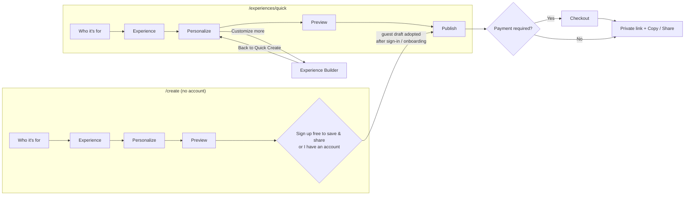

1. **Who it's for:** their name, your name or signature (prefilled with your first name), relationship, occasion (the template categories) and an optional date and note.
2. **Experience:** the occasion's templates with animated thumbnails, what they include (puzzles and games, questions, photo memories, letters, animated reveals), interaction tags, minutes and scene count. *Try it* plays the template with the names already filled in; *Surprise me* picks one at random, which can be changed. *See every occasion* widens the list.
3. **Personalize:** the template's own fields (`TemplateFields`), the opening greeting and final title, photos and captions (`MediaField`: vault, upload or camera), optional rewording of questions and quiz answers, the theme (`ThemePanel`) and a colour preset. Every box shows what's used if left blank. **Customize more** saves a draft and opens the builder.
4. **Preview:** `ExperiencePlayer` exactly as the recipient sees it, with phone and desktop frames, a scene picker, restart and full screen. Missing required fields are listed with **Fix** buttons.
5. **Publish:** it stays a draft until **Publish and get the link**. Publishing reuses the first recipient (or adds one with their name), sets visibility to `recipients`, publishes with no end time and shows the `/x/<code>` link with Copy and Share, a note that anyone with the private link can open it, and that opening it yourself counts as their visit.

**How it saves** (`experience-builder/hooks/useQuickCreate.ts`, logic in `experiences/scenes/quick-create.ts`):

- The draft (steps, answers, photo choices by `templateId/sceneKey/blockIndex`) is written to `localStorage` under `unveil:quick-create:<user id>` after every change, and sanitised when read back. A refresh or a dropped connection loses nothing.
- Entering Preview or Publish saves it as a draft experience: created once, then its title, description and theme are updated and its pages synced (`syncQuickScenes` in `templatesApi.ts`) only when they would change (signatures of the details and of the built scenes). Saves run one at a time; failures show **Retry** and keep the local copy.
- **Quick Create and Advanced Customize edit the same pages** (`experiences/scenes/quick-sync.ts`). Quick Create remembers which page and block each template scene became and what it last wrote there. Saving again is a three-way merge: it only changes what the creator hasn't changed in the builder, keeps pages added there, and never replaces pages. Choosing a different template after customizing asks first. The builder offers **Back to Quick Create** for this device's Quick Create draft.
- `buildQuick` builds the template with the creator's values and edits. Blocks still showing a sample photo are left out, and so are scenes that can't work without one; links and branches skip past them. Pages are stamped with the template id and version as usual.
- **Scratch cards** (reveal blocks with the scratch gesture) can hide a photo from the vault, with the message or instead of it (`hideText`).
- The Experience step filters by occasion (starting with the one picked in step one) and by kind of fun.
- Starting over, *Keep as draft*, *Customize more* and leaving after publishing clear the local draft; the experience stays in My Experiences.

**Without an account** (`/create`, `GuestCreatePage`): visitors can do the first four steps (who, experience, personalize, preview) with no sign-up.

- The draft is kept in `localStorage` under `unveil:quick-create:guest` (`experience-builder/guest.ts`). Nothing is sent to the server.
- Adding photos, **Customize more** and the last step need an account. The last step becomes a sign-up gate: **Sign up free to save & share** or **I have an account**, both returning to `/experiences/quick`. AI writing help isn't available to guests; the ready-made ideas still work.
- After sign-in (or sign-up and onboarding) the guest draft becomes the account's draft (`adoptGuestDraft` drops any saved state and photo choices), is saved as a draft experience straight away, and the guest copy is removed. It opens on the step they left (usually **Publish**, with payment first when it's required). A banner says it was brought over.
- Leaving for sign-up from the gate sets `unveil:quick-create:resume`, so finishing onboarding (also when opened from the confirmation email) returns to Quick Create. Otherwise sign-in and onboarding go to `/dashboard` as usual.
- `?occasion=<category>` presets the occasion on a fresh draft (both signed in and out); the landing page's category cards use it.

**Tests:** `tests/quick-create.test.ts` checks draft parsing, that every template builds a complete story without photos, photo scenes, greeting, finale and colours, question edits, scratch-card photos, *Surprise me*, what's missing, signatures and carrying a guest draft over.

## Help me write

Optional writing help in Quick Create and the builder. **AI is never required:** every field can be typed, every helper offers ready-made ideas that need no AI, and without AI (no provider, task off, limit reached or an error) the AI button is replaced by a note and everything else keeps working.

- **Where it appears** (a *Help me write* button under the field):
  - Quick Create: template fields that hold a message (not names, codes, clues, answers or one-word facts; see `fieldWriting`), balloon, star and prize lines, the greeting and final reveal, photo captions and notes, and question and quiz wording.
  - Builder: text, message (greeting and letter), reveal, image, video and memory captions, question and quiz blocks, and balloon, star and wheel messages in Scene settings.
  - Page settings → **Scene ideas**: ideas for one more scene, interaction or final reveal. The chosen idea becomes a new page after the current one (a scene plus a text block), and nothing else changes.
- **What the creator controls:** the occasion, tone (heartfelt, funny, playful, emotional), length, the kind of message (personal message, wish, compliment, appreciation, affection, caption, greeting, final reveal, prize) or letter, the question style (open, quiz, just for fun), the number of answers and optional friendly replies, and a few optional words about the recipient.
- **Review first:** AI results and ready-made ideas appear as editable cards, labelled *AI suggestion* or *Ready-made idea* (with *· edited* once changed). Each can be edited, discarded or used, and AI results can be regenerated. Nothing is inserted until **Use this**. If the field already has text, the creator chooses *Add after my text*, *Replace my text* or *Keep mine*.
- **Security and cost:**
  - The app sends a **brief**, not a prompt: `{ writing: { kind, occasion, tone, … } }` to the existing `ai-generate` function. The brief holds fixed choices plus at most the recipient's name, the relationship, the template title and up to 500 characters the creator typed. Photos, media, notes about people and anything else never leave the browser.
  - The server validates the brief strictly (`_shared/ai/writing.ts`), writes the instructions itself from the choices, and passes the free text only as delimited material. Replies are parsed against the exact shape and limits asked for; anything else is dropped.
  - Each kind uses the admin-configured task: messages and scene ideas `text_generation`, letters `message_generation`, questions `quiz_generation`. Plans, per-task limits, usage logging, fallbacks and errors are the existing ones.
  - Free-form `{ task, prompt }` requests are now **admin-only** (used by the task test on the AI settings page); everyone else gets `403`.
  - Requests only happen on an explicit click, one at a time, with a two-second cooldown. Typing, autosave, previews and scene navigation never call AI. Nothing generates images, video or audio.
- **Code:** `experience-builder/writing-help.ts` (briefs, reading replies, inserting text, ready-made ideas), `writing-samples.ts`, `writing-context.ts` (the recipient, relationship, occasion and template the helpers may mention), `hooks/useWritingHelp.ts` and `components/writing/`.
- **Tests:** `tests/writing-help.test.ts` and `supabase/tests/writing.test.ts` (brief validation, prompt separation, reply parsing, the service call, and that the app's choices match the server's).
- **Deploying:** no migration. Bundle and redeploy `ai-generate`, then enable the tasks you want in AI settings.

## AI editing in the builder

When a block is selected, **Edit with AI** at the top of its settings lists the actions that block offers and that the creator's plan allows. It's hidden when AI is off.

| Block | Actions | Field written |
| --- | --- | --- |
| Text, Message | Improve writing, Make funnier, Make more emotional, Make shorter, Make more romantic, Create message | `content.text` |
| Reveal | the rewrites, Create reveal | `content.text` (Create reveal also writes `teaser`) |
| Image, Video | the rewrites, Create caption | `content.caption` |
| Memory | the rewrites, Create caption | `content.note` |
| Question | the rewrites | `content.prompt` |
| Quiz | Generate quiz | `question`, `options`, `settings.correct_index`, `settings.explanation` (clears `feedback`) |
| Puzzle | Generate puzzle | `prompt`, `hint`, `settings.kind`, `settings.solution` |

Rewrites appear only once the field has text, and not when it's over 3000 characters.

- **Flow:** click an action → optionally pick the occasion and tone and add a note → **Generate** → an editable preview labelled *AI suggestion* → **Use**, **Regenerate** or **Cancel**. The block changes only on **Use**. After that the text is ordinary block content that can be edited like any other. If the request fails, is refused by a limit or returns something unusable, an error is shown and the block stays exactly as it was.
- **Only AI on click.** Selecting blocks, typing, autosave and previews never call AI. One request at a time, with a two-second cooldown.
- **Minimum context** (`buildEditBrief` in `experience-builder/ai-edit.ts`). A request sends `{ edit: { action, occasion, tone?, field?, text?, maxChars, recipient?, relationship?, details?, memory? } }`:
  - `text` is only the selected block's field, and only for rewrites.
  - `memory` is the block's own memory, as kind, title, description and date, and only for captions, notes and reveals.
  - Nothing else is sent: no other blocks or pages, no Memory Vault, and no files, URLs or ids.
  - The server refuses briefs that carry more than the action needs.
- **Server** (`_shared/ai/editing.ts`): it writes the instructions, passes the creator's words only as delimited material, and returns one result, checked strictly:
  - it must fit the field;
  - a rewrite must actually change the text, and "shorter" must be shorter;
  - puzzle answers can't appear in the prompt or hint;
  - quiz answers must be distinct, with one right one.
  - An unusable reply counts as a failed attempt, so the fallback model is tried.
- **Tasks, limits and usage** use the existing configured tasks, plans, limits, usage logging and fallbacks:
  - rewrites: `personalization`;
  - Create message: `message_generation`;
  - Create caption and Create reveal: `text_generation`;
  - Generate puzzle: `puzzle_generation`;
  - Generate quiz: `quiz_generation`.
- **Code:** `experience-builder/ai-edit.ts`, `hooks/useAiEdit.ts`, `components/writing/AiEditActions.tsx`, `runEdit` in `lib/ai/aiClient.ts`.
- **Tests:** `tests/ai-edit.test.ts` and `supabase/tests/editing.test.ts`, plus the handler and service tests.
- **Deploying:** run `017_ai_editing.sql`, then bundle and redeploy `ai-generate`, and enable the tasks you want in AI settings.

## AI infrastructure

This is a provider-agnostic foundation for AI features. **AI is optional:** with every provider and task off (the default), the app works exactly as before.

**AI Experience Generator:** `/experiences/generate` (linked from **New experience** when `experience_generation` is available) is a wizard: person → occasion → relationship → tone (up to two) → memories from the Memory Vault (up to 12) → length and look → optional notes → generate.

- **Structure and text only.** No images, video, voice or music are generated. Pages refer to the chosen memories by id.
- **What's sent:** the choices, names, notes, and each chosen memory's id, kind, title, description, date and (for video and audio) length. Never files, storage paths or URLs (`buildGeneratorBrief` in `features/experience-builder/experience-generator.ts`).
- **One request** (`{ experience: brief }` to `ai-generate`, task `experience_generation`, its configured provider and model). There's no free-form prompt for this task, not even for admins. No automatic retries; a short cooldown between attempts.
- **Validation:** the server (`_shared/ai/experience.ts`) checks each page and block against a strict schema, drops invented or wrong-kind memory ids and unknown blocks, fixes pages that can't play as their type, and cuts over-long stories while keeping the ending. The app reads the result again as untrusted data before creating anything.
- **Result:** a private draft with pages and blocks, opened in the Experience Builder. It's never published automatically.
- **Without AI:** **Create manually** is always offered. It creates a draft with the chosen person, occasion, theme and memories (a welcome, the memories and a closing message) and opens the builder.

**Flow:** browser → `ai-generate` Edge Function → `AiService` → provider adapter → provider API. The browser never calls a provider and never receives a key.

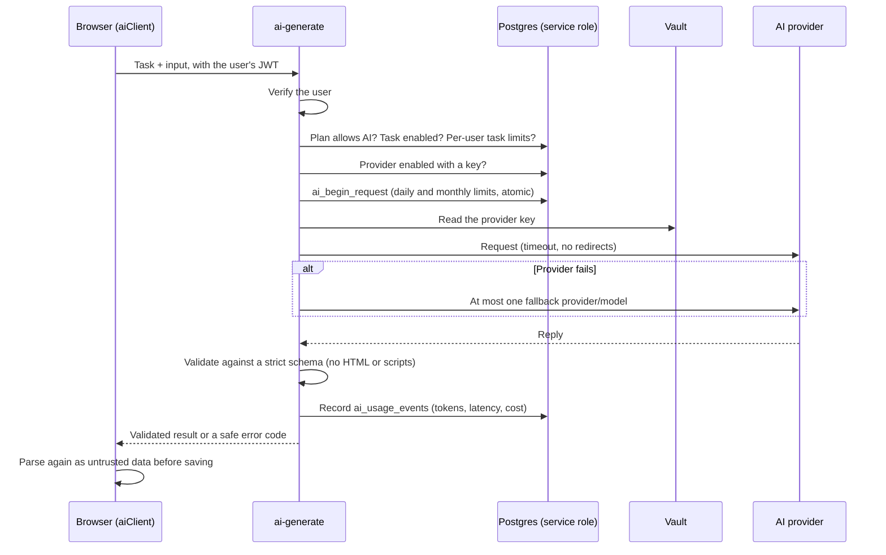

- **Providers:** Gemini, OpenAI and Anthropic adapters live in `supabase/functions/_shared/ai/adapters/`. Each implements `ProviderAdapter` (`generate`, `testConnection`) using plain `fetch`, a timeout, no redirects and normalised error codes.
- **Service** (`_shared/ai/service.ts`):
  - `generateText`, `generateStructuredContent` and `generateExperience`.
  - Each task has its own provider and model, with **at most one fallback**.
  - Structured output is validated against strict schemas (`_shared/ai/schemas.ts`). Unknown keys, HTML or scripts are rejected.
  - Experience drafts may only use these 13 block types: text, image/video/audio reference, question, quiz, puzzle, reveal, memory, quote, message, countdown and button. Media is always a reference to one of the user's memories; nothing is generated.
- **Checks, in order, before any provider call:** authentication → plan allows AI → task enabled and within the task's per-user limits → provider enabled with a key → plan's daily and monthly usage (`ai_begin_request`, run atomically) → call. Every attempt is recorded in `ai_usage_events` with its tokens, latency, error code and estimated cost. `ai_usage_daily` rolls these up, and `ai_usage_monthly` sums them by month. Days and months are **UTC**.
- **Admin page** (`/admin/ai`, `features/admin/`):
  - For each provider: status, enabled, default and fallback models, "API key configured" or "No API key" (the key is never shown), today's and this month's usage and cost, and the tasks that use it.
  - Actions: save or update the key, remove the key, and **Test connection** (Success or Failure with a safe message).
  - Edit tasks, plans and model prices.
  - The nav link only shows for admins. Every action goes through the `ai-admin` function, which re-checks `app_admins` on each request.
- **Client:** `src/lib/ai/aiClient.ts` (`runWriting` for *Help me write*, `runExperienceGenerator`, admin-only `runAiTask`, `invokeEdgeFunction`) and `useAiTasks()`, which lists the tasks the signed-in user can run so AI buttons can be hidden when they can't.

**Setup** (after running `014`, `015` and `016`): deploy `ai-admin` and `ai-generate` and set the secrets as described in [Edge Functions](#edge-functions) (CLI or bundled files in the Dashboard editor).

```sql
-- Add admins (SQL Editor). Each email must already have an account; unknown emails and existing admins are skipped.
insert into public.app_admins (user_id)
select id from auth.users
where lower(email) in ('alice@example.com', 'bob@example.com')
on conflict (user_id) do nothing;

-- List admins
select u.email, a.created_at
from public.app_admins a
join auth.users u on u.id = a.user_id
order by u.email;

-- Remove an admin
delete from public.app_admins
where user_id in (select id from auth.users where lower(email) = 'bob@example.com');

-- Optional: prune raw usage events nightly (keeps 90 days; daily totals are kept)
select cron.schedule('ai-prune', '17 3 * * *', $$select public.ai_prune_usage_events()$$);
```

Admin status is cached in the browser for up to 10 minutes, so reload the app after adding or removing an admin.

Then open **AI settings**:

1. Save a provider key and click **Test connection**.
2. Enable the provider.
3. Enable the tasks you want.
4. Optionally add model prices so costs are estimated.

Users without a row in `ai_user_plans` are on the `free` plan.

**Security notes:**

- Keys are sent once over HTTPS to `ai-admin`, stored encrypted in Supabase Vault, and never returned or logged. The page only knows `configured` and whether the key comes from Vault or an environment secret.
- Postgres statement logging (if you turn it on) could capture the key argument of `ai_store_provider_key`. Keep `log_statement` at its default (`none`), or use environment secrets instead.

**Adding a provider:**

1. Write an adapter in `_shared/ai/adapters/`.
2. Register it in `_shared/ai/registry.ts`.
3. Add tests in `supabase/tests/adapters.test.ts`.
4. Deploy. It then appears under "Add a provider" on the admin page.

**Verifying:**

- After `014`, `015` and `016`, run `supabase/verification/ai_infrastructure_check.sql`. It should return `PASS: all AI infrastructure checks passed`.
- `npm run check:functions` and `npm run test:functions` type-check and test the functions: adapters, schemas, service fallback and limits, handlers and admin authorisation.

## Admin console and payments

- **Server-side admin checks.** Every console request goes through the `admin-console` Edge Function, which re-checks `app_admins` for the caller's JWT on each call. Admin tables have RLS with no browser policies; the client-side `useIsAdmin()` only decides what to render.
- **Private memories stay private.** Admins see memory *counts*, never memory content or media. Reviewing a reported experience shows its text fields only, behind an explicit "Show text" action that is written to the audit log.
- **Audit log.** Every change (suspend/restore, block/unblock, grant sharing, experience end times/end/delete, report resolution, templates, gifts, payment settings, secrets, coupons, plans) and every sensitive read is appended to `admin_audit_log`. Entries are immutable; the explicit admin purge action is the only deletion path and leaves a new immutable record with the admin and number of entries cleared.
- **Moderation.** Suspending a user bans sign-in and stops their links; blocking an experience stops its links. Recipients can report an experience with the flag button on the recipient page (one open report per link, at most three a day).
- **Experiences.** Besides block/unblock and grant sharing, admins can set, change or clear the end time of any scheduled or live experience, end a live one straight away, or delete one permanently (a reason is required; its contributed files are removed from storage first). If a schedule or end time has already passed, the stored status is caught up before the change.
- **Templates.** Admins can hide, feature and reorder templates in the pickers, give a template an end date (after which creators no longer see it), or delete it (hidden from creators, with **Restore** to bring it back). Templates are defined in the client, so these are presentation settings only; experiences already made from a template keep working.
- **Payments (Razorpay).**
  - Admins turn payments on or off and set the price per experience in **Admin → Payments**, along with the Razorpay key id. The key secret and webhook secret are sent once, stored in Vault and never shown again.
  - While payments are on and the price is above zero, a published experience's links don't open until it's unlocked. The owner sees a checkout (optional gift products, coupon, Razorpay) wherever links are shared. Amounts are always computed on the server.
  - Unlocks come from a verified payment (checkout signature or the `payments-webhook`), a 100% coupon, publishing while payments are off, an admin grant, or having been published before `020`.
  - Coupons (percent or fixed, max uses, expiry) can only be created by admins.
  - Admins can clear payment order history from **Admin → Payments**. This deletes paid, pending, failed and free checkout records and changes revenue reporting; existing unlocks stay active. Review accounting retention needs first.
  - Admins can clear the audit history from **Admin → Audit log**. The operation removes prior entries and retains a new immutable audit record documenting the purge.

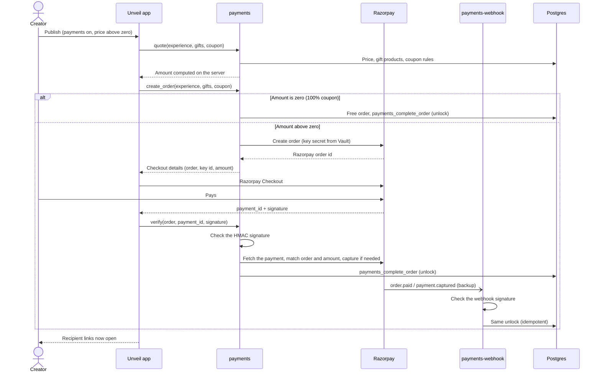

**Setup** (after running `020` and `supabase/verification/admin_payments_check.sql`): deploy `admin-console`, `payments` and `payments-webhook` (JWT verification off), and redeploy `ai-admin` and `ai-generate` because `_shared` changed. See [Edge Functions](#edge-functions) for the CLI and Dashboard-editor steps, and step 5 of the [first-time setup checklist](#first-time-setup-checklist) for Razorpay.

**Short links, end times and deletes:** run `022_short_links_and_template_expiry.sql` *before* deploying the frontend (the app reads `short_code`), then bundle and redeploy `admin-console`.

### About page

`/about` shows the platform's story (default text in `features/about/about-content.ts`) and, once named, one card per creator (photo, role, multi-paragraph bio), plus links and a contact email.

- **Editing:** **Admin → About page** edits the headline, intro, story, highlight cards (up to 6), the creators (up to 6, reorderable; one is optional, a nameless creator stays hidden), links (up to 10) and the contact email. Blank page text falls back to the default wording. A new creator starts with a built-in role and first-person bio.
- **Help me write (bios):** each creator's bio has **Help me write** with six ready-made, multi-paragraph bios about the person who engineered the platform (three as “I”, three using their name; `creatorBioIdeas`). Each can be edited before **Use this**; existing text is only replaced or added to after asking.
- **Saving** goes through `admin-console` (`about_save`), which checks the admin, validates every field strictly (lengths, no markup, links must be `https://` or `mailto:`, photos must be `about/` paths, frames in range) and writes `admin_audit_log` (`about_page_updated`).
- **Photos and framing:** the whole picture is kept (scaled to 1200 px, re-encoded as WebP in the browser) and uploaded to the public `site-assets` bucket (admins only). The admin picks a frame (*Whole photo*, *Square*, *Portrait* 4:5 or *Circle*), then drags the photo or uses the zoom and position sliders; the page shows exactly that framing (`photo_frame`: shape, x, y, zoom, rendered with `object-position` and `scale`). **Show photo** (per creator, on by default) hides the photo or initials on the public page without deleting it, and the bio then uses the full width. Photos no longer used are deleted after a successful save. Content saved with the older single `creator` still loads (a blank role or bio gets the built-in one).
- **Deploying:** run `021_about_page_and_guest_create.sql`, then bundle and redeploy `admin-console`. Until `021` runs, `/about` shows the default text and the admin section shows an error. If saving shows `Invalid request: content.creators is not allowed`, the deployed `admin-console` is older than the app: redeploy it.

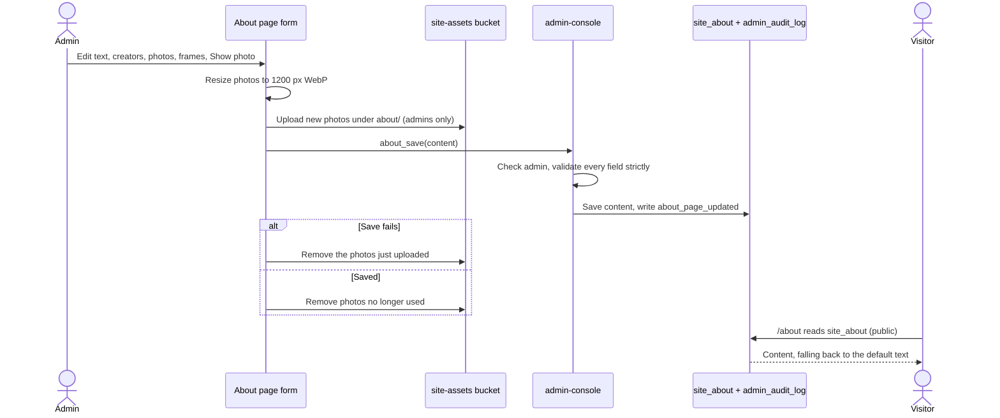

## Installable app and link previews

Unveil is a **Progressive Web App**: people can install it on Android, iPhone, iPad, Windows, macOS, Linux and ChromeOS, and it then opens from its own icon in a standalone window, with no app store.

**What makes it installable**

| File | Role |
| --- | --- |
| `public/manifest.webmanifest` | Name, colours, `start_url` `/dashboard`, standalone display, icons (192, 512 and a maskable 512) and shortcuts (Create a surprise, Memory Vault, Occasions). |
| `public/sw.js` | Service worker. Page loads are network-first, with the last good `index.html` as an offline fallback; hashed files in `/assets/` are cache-first. It never handles other origins, so Supabase data, files and fonts always come from the network. Bump `VERSION` to drop old caches. |
| `src/lib/pwa.ts` | Registers the service worker (production builds only), captures the browser's `beforeinstallprompt`, and works out the install mode. |
| `index.html` | Links the manifest, `apple-touch-icon` and the iOS web-app meta tags. |

**How the Install app button behaves**

| Browser | Mode | What happens |
| --- | --- | --- |
| Chrome, Edge, Samsung Internet, Opera (Android and desktop) | `prompt` | The browser's own install dialog opens. |
| Safari and other browsers on iPhone / iPad | `ios` | A dialog shows the steps: Share → Add to Home Screen → Add. |
| Safari on macOS | `safari` | A dialog shows File → Add to Dock. |
| Already running as the installed app | `installed` | Install UI is hidden; Settings says it's installed. |
| Firefox desktop and others | `unsupported` | Install UI is hidden; Settings explains which browsers to use. |

Where it appears:

- A dismissible banner at the top of the **Dashboard**, with phone or computer wording. Closing it hides it for 30 days (`localStorage` `unveil:install-dismissed`).
- **Install app** in the sidebar and in the mobile **Everything** sheet.
- An **Unveil app** card in **Settings**, which is always shown.
- **Install app** in the footer of the landing and About pages.

There's no install UI on recipient or contributor links, so the surprise stays uninterrupted.

**Link previews.** `index.html` carries Open Graph and Twitter card tags, so WhatsApp, iMessage, Telegram, Slack, Discord, X, LinkedIn and Facebook show the Unveil logo, title and `public/og-image.jpg` (1200×630) when a link is shared.

- Crawlers need absolute URLs. `index.html` uses a `__SITE_URL__` placeholder that `vite.config.ts` replaces with `VITE_SITE_URL` at build time; without it the URLs stay relative and most apps show no picture.
- The preview is the same for every URL, including recipient links. That's deliberate: crawlers don't run JavaScript, and a generic preview never leaks a surprise's title or content.
- Apps cache previews, often for days. After changing the image, test with a fresh URL, or use the Facebook Sharing Debugger / LinkedIn Post Inspector to refresh.
- To regenerate the icons or preview image, keep the same file names and sizes and bump `VERSION` in `sw.js`.

## Design system

The look is **warm, emotional and premium**, not a generic SaaS dashboard.

- **Typography:** _Fraunces_ (display serif, used for headings and emotional moments; `<em>` gets an ember accent) and _Plus Jakarta Sans_ (UI and body text).
- **Palette** (`@theme` tokens → Tailwind utilities):
  - `canvas` / `surface`: warm ivory backgrounds
  - `ink-*`: warm brown-black text scale
  - `ember-*`: primary rose-coral
  - `saffron-*`: moments of delight
  - `plum-*`: depth and immersive screens
  - `sage-*`: calm confirmation
- **Shape and depth:** `rounded-card` (1.75rem), pill buttons, `shadow-soft`, `shadow-lifted`, `shadow-glow`.
- **Motion:** `animate-fade-up`, `animate-fade-in`, `animate-float`, `animate-pop-in`, `animate-shimmer`, `animate-drift` (floating decorations on the sign-in pages). Entrances use `ease-gentle`; loops use `ease-in-out` or `linear`. Motion is disabled when the user has `prefers-reduced-motion` set.
- **Backgrounds:** `bg-aurora` (soft radial warmth) and `bg-ember-gradient`.

### Light and dark mode

Users pick **Light**, **Dark** or **System** from the account menu, **Settings → Appearance**, or the landing page header. The choice is saved in `localStorage` (`unveil-theme`) and syncs across tabs. System follows the device and updates live.

- **How it works:** `.dark` on `<html>` swaps the palette variables in `src/styles/index.css`, so all `ink-*` and accent utilities follow automatically. An inline script in `index.html` applies the theme before first paint. `src/lib/theme.ts` owns the state, and `useTheme()` in `src/lib/useTheme.ts` reads it.
- **Scale behaviour:** neutrals invert (`ink-900` becomes the lightest text). Accent tints (50–300) darken and deep shades (600–900) lighten. Solid accents (`ember-400/500`, `saffron-400/500`, `plum-400`, `sage-500`) stay the same, so white text on them keeps working.
- **Extra tokens:**
  - `night` is always dark. Use it for media letterboxing, scrims and dialog backdrops, never `ink-900`.
  - `elevated` is a surface raised above `surface` (white in light mode).
- **Selected pills:** pair `bg-ink-900` with `text-canvas`, not `text-white`.
- **`data-palette="fixed"`:** re-applies the light palette to an element and everything inside it. It's used on experience surfaces (`PageSurface`), artwork (auth panel, memory gradients, the plum `Card`) and avatar initials. Keep its values in sync with `@theme`.
- **Recipients:** `/x/:code` and `/experience/:token` always render light (`useLightThemeOnly()`), because every experience brings its own theme.

Guidelines: use generous spacing (`px-5 sm:px-8 lg:px-12`, `py-8 lg:py-12`) and mobile-first classes. Build pages from `PageContainer` + `PageHeader`, and use `EmptyState` for empty and placeholder states. **Never show fake sample data.** Show an honest empty state instead.

---

## Testing

| Layer | How | What it covers |
| --- | --- | --- |
| Types | `npm run typecheck`, `npm run check:functions` | Strict TypeScript for the app, the Edge Functions and their tests |
| Lint | `npm run lint` | ESLint (React hooks, refresh, TypeScript rules) |
| App logic | `npm run test:app` | `tests/*.test.ts`: scenes engine, Quick Create and its sync with the builder, recipient playthroughs of every template category, AI editing and the generator, writing help, dashboard, About content |
| Edge Functions | `npm run test:functions` | `supabase/tests/*.test.ts`: AI adapters, schemas, service fallback and limits, handlers, admin authorisation, admin console validation, payments and webhook signatures (no network) |
| Database | `supabase/verification/*.sql` in the SQL Editor | RLS, grants, triggers and RPCs per migration; each script rolls back and prints `PASS: ...` |
| Manual | [Verifying](#verifying) | Sign-up, onboarding, sign-out and redirects in the browser |

Before shipping a change, run:

```bash
npm run lint
npm run test:app
npm run test:functions
npm run build
```

If anything under `supabase/functions/` changed, also run `npm run bundle:functions` and redeploy the affected functions.

---

## Adding a feature

1. **Schema first.** Add a new migration with the next number (currently `024_<name>.sql`). In it:
   - Create the table with `owner_id uuid not null default auth.uid() references auth.users on delete cascade`, plus `created_at` and `updated_at`.
   - Run `alter table … enable row level security;` and write `select` / `insert` / `update` / `delete` policies using `(select auth.uid()) = owner_id`.
   - Add the shared `public.set_updated_at()` trigger.
   - Index `owner_id` and any foreign keys.
   - For media, create a private bucket with owner-folder storage policies (see `002_storage_avatars.sql`).
2. **Types.** Run `npm run db:types`. Never hand-write row types in feature code; derive them with `Tables<'people'>`.
3. **Feature folder.** Create `src/features/<feature>/` containing:
   - `api/`: plain async functions that call `supabase` and throw on `error`
   - `hooks/`: TanStack Query hooks with a `<feature>Keys` query-key factory
   - `components/`: feature-specific UI built from `components/ui`
   - `pages/`: route components (default export, lazy-loaded)
4. **Routing.** Add the path to `app/paths.ts`, register the lazy page in `app/router.tsx`, and add it to `app/navigation.ts` if it needs a nav entry.
5. **Privileged logic** (AI, payments, emails, recipient-link resolution) goes in `supabase/functions/<name>` (Edge Functions). Never put it in the browser.

## Roadmap

**Built:** accounts and onboarding, people, occasions, Memory Vault and memory stories, the experience data layer and builder, interactive blocks and scenes, 31 templates, Quick Create (with guest mode), recipient links, scheduling and Surprise Drop, friend contributions, group links, Group Secret, AI writing, editing and generation, the admin console, Razorpay payments, the About page, and light and dark mode.

**Planned (not implemented):**

- Builder collaboration: editing by `editor` collaborators, real-time presence, and inviting collaborators by email.
- Notifications: email and push reminders driven by `reminder_days_before`, and email/SMS delivery of scheduled experiences and contribution invitations.
- Automatic AI compilation of friend contributions.
- Word puzzles, and moving blocks between pages in the builder.
